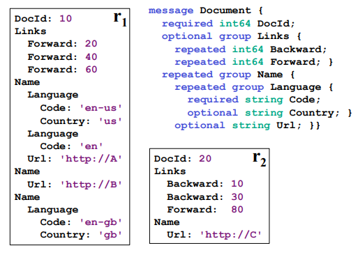
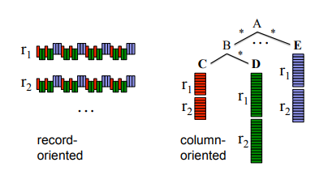
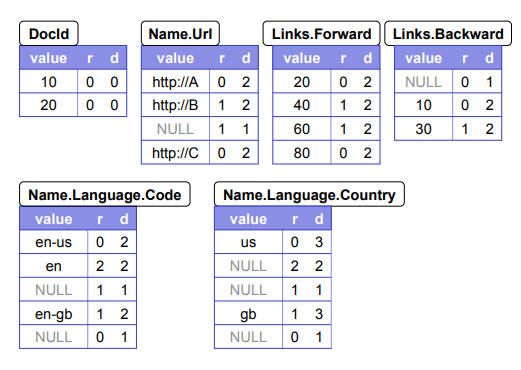
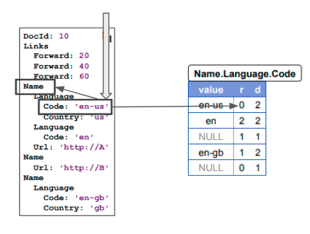
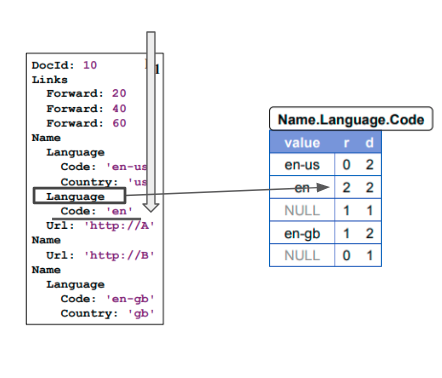
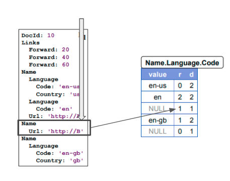
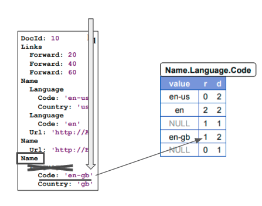
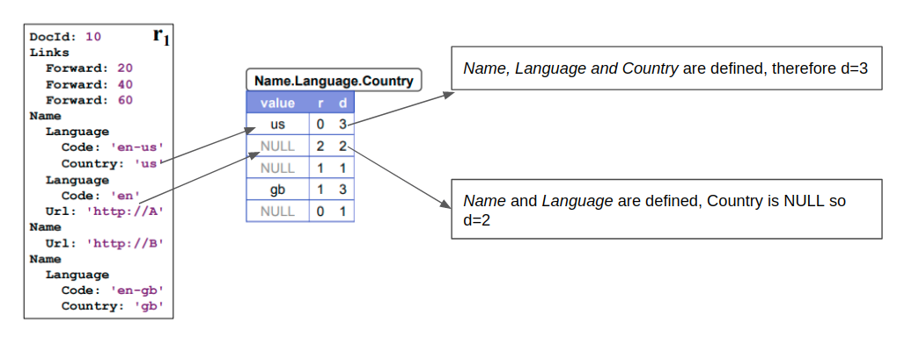
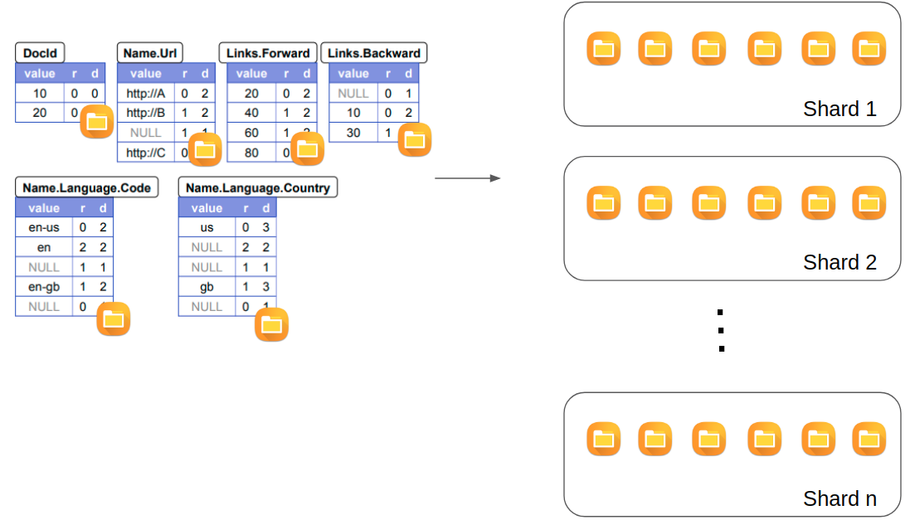
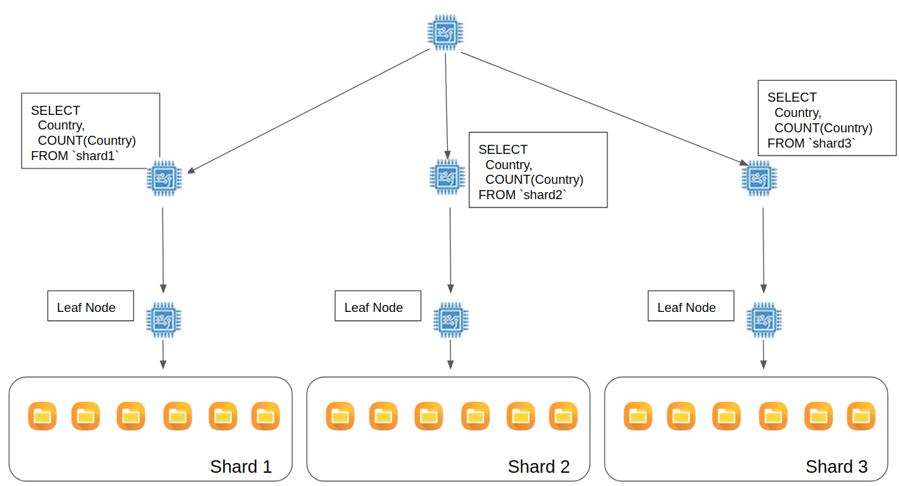

# Class 01: Introduction

## Overview

BigQuery is a powerful serverless database service fully hosted by Google capable of processing terabytes of data in a few seconds.

Special emphasis for the *serverless* description: this means that we actually don't have to take any responsability with infrastructure or architectural designs in order to keep the tool up and running. In practice, using it is so simple that anyone can create an account, login for its sandbox environment and start using it right away.

In fact, it's due this simplicity that we started using it as our main database tool and now came up with this quick and dirty tutorial to teach a bit about what we've learned, some cool techniques and share some ideas for you to use in your projects as well.

As it keeps growing in popularity ([Kaggle](https://www.kaggle.com/dansbecker/getting-started-with-sql-and-bigquery) has already integrated its challenges datasets with BigQuery), knowing how to make good use of the tool can turn out to be a strong competitive advantage for undertaking new ideas and projects.

For what it follows, we'll give a brief overview of its architecture; this is not mandatory in order to understand BigQuery and we wrote it more for those who are curious. If you want to skip straight to action, please refer to section [x.x](#architecture).

## Architecture

Here, we'll briefly discuss on what is happening behind the scenes for BigQuery and its internal architecture; knowing it will help you to understand more about its philosophy on processing data (which basically comes from the Dremel architecture) and will allow you to further optimize big data processing.

To begin with, BigQuery is the integration of the following tools working together: [Colossus](https://cloud.google.com/files/storage_architecture_and_challenges.pdf), [Capacitor](https://cloud.google.com/blog/products/gcp/inside-capacitor-bigquerys-next-generation-columnar-storage-format), [Jupiter](https://cloudplatform.googleblog.com/2015/06/A-Look-Inside-Googles-Data-Center-Networks.html), [Dremel](https://storage.googleapis.com/pub-tools-public-publication-data/pdf/36632.pdf) and [Borg](https://ai.google/research/pubs/pub43438) as show below:

<p align="center">
  
</p>

Ok, that's lots of tools and each carries a whole universe of knowledge and concepts within themselves; while we won't cover the details, let's see briefly their purpose.

### Colossus

This is the fault-tolerant world-wide distributed storage system where our data is stored. If you look closely, you'll notice that it is separated from other componentes through the *Jupiter* network.

Yeap, that's right. At first this seems crazy, then you realize it's actually brilliant. When we send our data to BigQuery, the information is sent to Colossus which first applies different transformations on it (encoding and compressing to Capacitor format files) then finally replicates the data through different datacenters to ensure fault-tolerance.

Well, so you are probably asking yourself: "Ok but what if we query dozens of terabytes of data?! It'd be necessary to transfer teras through the network!!!".

Yeap again, that's right. But as it turns out, Jupiter is capable of processing up to *Petabytes* of data per second. You read that right, it's petabytes per second.

This is a very cool thing about the design worth keeping note of: *storage and processing are separate*. As Jupiter is insanely powerful, this enables the system to operate at much cheaper rates by using a multi-tenant architecture where you only pay for what you use. When we run queries, data is transferred to the computing servers, processed and results are returned which turns off computing costs. Effectively, you only pay for the amount of data queried over and its storage, nothing else. On top of that, the architecture ends up being quite flexible: changes made to the storage system doesn't affect processing servers or the other way around.

Now, as just mentioned, Colossus saves data in Capacitor format which is used by Dremel; lots of strategies and concepts happens here so let's dig a bit further into these tools.

### Capacitor

Here is one of the main points that makes BigQuery as powerful as it is: Dremel is fully designed to work with *nested data*.

Now, we should say, it gets practice to feel comfortable working with this type of data but once you master it, there's virtually no demand that comes into your way where you won't be able to effectively extract insights and answers to your demands.

You can think of nested data as a tree like structure that describes values and their relations between nodes; it can be thought as of a json-like format and, in fact, if you think about jsons when using BigQuery this can already be quite helpful when building queries.

To visualize it, let's see an example extracted from the Dremel paper as presented by Google:

<p align="center">
  
</p>

This follows a tree like structure that is represented (using the jargon as presented in Dremel's paper) as:

<p align="center">
  
</p>

The symbol *?* means the field is optional; + means it's repeated and required; \* means optional repeated.

It could also be represented by something that resembles a json-like format (this might help some to better visualize the data):

```json
[
    {
        "DocId": 10,
        "Links": [{"Forward": 20}, {"Forward": 40}, {"Forward": 60}],
        "f0_": [
            {"Name": [{"Language": {"Code": "en-us", "Country": "us"}}, {"Language": {"Code": "en"}}], "Url": "http://A"},
            {"Name": [{"Url": "http://B"}]},
            {"Name": [{"Language": {"Code": "en-gb", "Country": "gb"}}]}
        ]
    },
    {
        "DocId": 20,
        "Links": [{"Backward": 10}, {"Backward": 30}, {"Forward": 80}],
        "f0_": [
            {"Name": [{"Url": "http://C"}]}
        ]
    }
]
```

Not only does Dremel work with nested data but also it follows a colunar type of storage; this is expected, most databases working with massive amounts of data uses this approach due advantages such as better degrees of compression and faster processing times; each field we have in our database is saved as a capacitor file containing all data of each column independently.

But, this is not a very straightforward thing to do. Keep in mind that every single record we have in our database has to be divided in its tree like structure and saved in a colunar format; bellow we see a representation of that:

<p align="center">
  
</p>

If we just save all values of a given node in a colunar format file, it won't be possible anymore to know when a given record started and when it ended or what values belong to a repeated field or not.

For fixing this, Capacitor saves for each value in our tree data two additional columns: *repetition (r)* and *definition level (d)*.

"repetition" is a number that indicates which repeated field has repeated for the current value.

Sounds complicated and understanding it requires reading through some examples; let's see with our previous data to understand it better. To begin with, here's a full table of Capacitor files that would be saved in Colossus for our document data:

<p align="center">
  
</p>

Let's exam the field *Name.Language.Code*; the file would have the values "en-us", "en" and "en-gb".

In *Code* path we have two repeated fields, *Name* and *Language*. Therefore, r varies between 0 and 2; 0 (zero) indicates it's the very first time we are observing the value; 1 means *Name* has repeated and 2, field *Language*.

So when BigQuery scans down through Colossus, in this case, it first finds the value "en-us"; as it's the first time the value has appeared in the *Name.Language.Code* path, it receives a zero:

<p align="center">
  
</p>

Then it keeps scaning through the data to find the value "en" which happens inside the *Language* repeated field; it receives, therefore, value 2:

<p align="center">
  
</p>

Now there's one issue: the next value is `NULL`; it still has to be represented as otherwise BigQuery can't reconstruct the record properly. It woudn't know, for instance, whether there's an empty value there or if it's some value associated to other repeated field.

Dremel solves this by pretending there's a dummy `NULL` value there; it gets represented with `r=1` since *Language* did not appear but *Name* did, which represents the value 1:

<p align="center">
  
</p>

Finally, when BigQuery sees the last value, the field *Name* is the one who repeated, not *Language* (so it knows this value belongs to another tree associated to another *Name* branch); given it was *Name* the repeated field, it should receive value 1 then:

<p align="center">
  
</p>

But knowing just the repetition index wouldn't allow Dremel to fully reconstruct the record; problem arises when we have `NULL` values at some point in the tree structure; having only the repetition wouldn't allow a full reconstruction as the information about which level is actually missing wouldn't be available.

For instance, suppose that *Code* is no longer a required field. When its value is `NULL`, how could we know whether it's related to field *Code* or *Language* being missing?

That's where the *definition level (d)* comes into play. It represents how many fields in the path were actually defined. BigQuery uses this information to know at which level in the tree the `NULL`s values are actually happening.

Here's an example with the field *Country* which is not required:

<p align="center">
  
</p>

Last thing to know about the storage strategies for BigQuery is that it still separates our files into different shards which works basically as partitions of data; we don't have control over how the system creates and manages those divisions, it runs its own optimizations to figure out what an appropriate setup is for our data. End result is shown below:

<p align="center">
  
</p>

Finally, this is how our data is encoded when saved to Colossus. Basically, when we run queries, there are different techniques running in the background to reconstruct the whole record; for us, enough to think of data as a json-like object that makes processing data more efficient.

By "efficient" we mean processing the most information with the least amount of slots being allocated to our queries. Talking about slots, time to dive into Dremel architecture.

### Dremel

Probably Dremel could be considered sort of like "the brain" of the whole thing. Colossus stores all of our data using Capacitor files; when queried over, they are brought to the processing server through the Jupyter network. Now, the one managing who process what, when and how is Dremel.

Funny thing is, it also works by building a tree like structure with different servers on each branch; it all starts in the root server that receives our query. 

Say, using our previous example data, that we sent a query like (not a valid query, just for learning purpose):

```sql
SELECT
  Country,
  COUNT(Country) AS freq
FROM `table`
```

That query would first be sent to Dremel in a root server.

This node then divides the query into different servers known as the "Mixers" which works with specifics shards; processing is finally handled to leaf node servers that have access to Colossus. Results are then brought back to mixers where operations such as aggretation or filtering happens and the cycle repeats through the root server until final result is consolidated:

<p align="center">
  
</p>

Notice that the paradigm is to actually bring hardware to data: the more demanding the query is, the more mixers and leaf nodes are brought together to process the query.

Each application running on the leaf nodes have a certain number of threads: each *thread* is called a *slot*.

This is important to keep in mind: BigQuery service comes with 2000 slots available for processing your demands (while it's still possible to increase this value by getting in contact with Google representatives, if you know how to properly use BigQuery that chances of you needing that is extremely low).

As we'll be studying soon, the less optimized are the queries we send against BigQuery, the more slots will be required for the processing step which may, eventually, stop the tool from working optimally and slower its operations.

One of the best techniques for being effective in BigQuery is to deeply understand how to leverage its nested data paradigm. In fact, let's start some hands-on experience now.

Enough with introduction and concepts, time for getting our hands dirty. Let's move on to [Class 02](../Class02_Arrays_And_Structs/README.md) where we'll start learning about Arrays and Structs!
