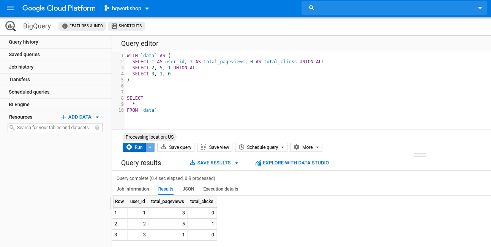

# Arrays And Structs

This tutorial covers the following:

1. [Introduction](#1-introduction)
2. [Arrays](#2-arrays)
    1. [Task1](#21-task1)
    2. [Task2](#22-task2)
    3. [Offset](#23-offset)
    4. [Task3](#24-task3)
    5. [Unnest](#25-unnest)
    6. [Task4](#26-task4)
3. [Structs](#3-structs)

## 1. Introduction

As we've seen in Class 01, one of the biggest powers of BigQuery comes from operating nested data directly; the better we use this paradigm the less operations will be performed in the shuffle phase making BigQuery more effective, cheaper and faster.

But also, as we've discussed before, it gets some practice before getting used to that. So, with no further ado, let's get some practice.

Head over to your [BigQuery WebUI](https://console.cloud.google.com/bigquery) (if you haven't already please follow through [Class00 Setup](../Class00_Setup/README.md) for setting up the required environment) and run our very first demonstration query:

```sql
WITH `data` AS (
  SELECT 1 AS user_id, 3 AS total_pageviews, 0 AS total_clicks UNION ALL
  SELECT 2, 5, 1 UNION ALL
  SELECT 3, 1, 0
)


SELECT
  *
FROM `data`
```

You'll get something like this:

<p align="center">
  
</p>

In this example, we have a simulation of customers visiting a web page; first column is the user identification, second is how many pages were visited and, finally, how many clicks were tracked.

Notice the response can be represented as a JSON as well where each row represents each user:

```json
[
  {
    "user_id": "1",
    "total_pageviews": "3",
    "total_clicks": "0"
  },
  {
    "user_id": "2",
    "total_pageviews": "5",
    "total_clicks": "1"
  },
  {
    "user_id": "3",
    "total_pageviews": "1",
    "total_clicks": "0"
  }
]
```

And there you have it; no need to setup infrastructure or install applications, just open the console and run queries, BigQuery takes care of everything for us.

All types defined in other databases are also available in BigQuery; run the following to see some possibilities:

```sql
WITH `data` AS (
  SELECT 
    'string' AS STRING,
    1 AS INT64,
    1.25 AS FLOAT64,
    99999999999999999999999999999.999999999 AS NUMERIC,
    FALSE AND TRUE AS BOOLEAN,
    b'0x00' AS BYTES,
    DATE('2019-01-01') AS DATE,
    DATETIME('2019-01-01') AS DATETIME,
    '23:59:59' AS TIME,
    TIMESTAMP('2019-01-01 00:00:00') AS TIMESTAMP,
    ST_GEOGPOINT(40.3, 30.5) AS GEOPOINT
)


SELECT
  *
FROM `data`
```

Let's come back to our first query now: suppose we want to track which were the pages visited and which products were clicked; we'll track each "hit" on our web site, its number identification and what happened there.

To do so, run the following in your BigQuery:

```sql
WITH `data` AS (
  SELECT 1 AS user_id, 3 AS total_pageviews, 0 AS total_clicks, 0 AS hit_number, 'bq_workshop_page_1.html' AS page, NULL AS sku UNION ALL
  SELECT 1 AS user_id, 3 AS total_pageviews, 0 AS total_clicks, 1 AS hit_number, 'bq_workshop_page_2.html' AS page, NULL AS sku UNION ALL
  SELECT 1 AS user_id, 3 AS total_pageviews, 0 AS total_clicks, 2 AS hit_number, 'bq_workshop_page_3.html' AS page, NULL AS sku UNION ALL
  
  SELECT 2 AS user_id, 5 AS total_pageviews, 1 AS total_clicks, 0 AS hit_number, 'bq_workshop_page_1.html' AS page, 'sku0' AS sku UNION ALL
  SELECT 2 AS user_id, 5 AS total_pageviews, 1 AS total_clicks, 1 AS hit_number, 'bq_workshop_page_2.html' AS page, NULL AS sku UNION ALL
  SELECT 2 AS user_id, 5 AS total_pageviews, 1 AS total_clicks, 2 AS hit_number, 'bq_workshop_page_3.html' AS page, NULL AS sku UNION ALL
  SELECT 2 AS user_id, 5 AS total_pageviews, 1 AS total_clicks, 3 AS hit_number, 'bq_workshop_page_4.html' AS page, NULL AS sku UNION ALL
  
  SELECT 3 AS user_id, 1 AS total_pageviews, 0 AS total_clicks, 0 AS hit_number, 'bq_workshop_page_1.html' AS page, NULL AS sku
)

SELECT
  *
FROM `data`
```

This is the result:

<table pan-table="" class="p6n-bq-results-table-pb p6n-table" role="grid" jslog="47391;track:generic_click"> <thead pan-sort-agent="sortCtrl"> <tr><!----> <th>Row</th> <!----><th ng-repeat="header in ctrl.schema.fields track by (ctrl.tableId + $index)"> user_id </th><!----><th ng-repeat="header in ctrl.schema.fields track by (ctrl.tableId + $index)"> total_pageviews </th><!----><th ng-repeat="header in ctrl.schema.fields track by (ctrl.tableId + $index)"> total_clicks </th><!----><th ng-repeat="header in ctrl.schema.fields track by (ctrl.tableId + $index)"> hit_number </th><!----><th ng-repeat="header in ctrl.schema.fields track by (ctrl.tableId + $index)"> page </th><!----><th ng-repeat="header in ctrl.schema.fields track by (ctrl.tableId + $index)"> sku </th><!----> <th class="p6n-bq-empty-last-column"></th> </tr> </thead> <tbody> <!----><tr pan-table-row="" ng-repeat="row in ctrl.rows | panSortBy:(sortCtrl&amp;&amp;sortCtrl.getActiveKey()):&quot;normal&quot;:sortCache:paginateCtrl  track by (ctrl.tableId + ':' + row.rowTrackBy + ':row' + $index)" class="p6n-bq-last-row-of-record" ng-bind-html="row.htmlRow" ng-init="$last &amp;&amp; panTableCtrl.onRowRepeatEnd()" pan-table-row-after-repeat="row"><td class="p6n-bq-row-number">1</td><td class="p6n-bq-number-cell"><div>1</div></td><td class="p6n-bq-number-cell"><div>3</div></td><td class="p6n-bq-number-cell"><div>0</div></td><td class="p6n-bq-number-cell"><div>0</div></td><td><div>bq_workshop_page_1.html</div></td><td><div class="p6n-bq-null-cell">null</div></td><td class="p6n-bq-empty-last-column"></td></tr><!----><tr pan-table-row="" ng-repeat="row in ctrl.rows | panSortBy:(sortCtrl&amp;&amp;sortCtrl.getActiveKey()):&quot;normal&quot;:sortCache:paginateCtrl  track by (ctrl.tableId + ':' + row.rowTrackBy + ':row' + $index)" class="p6n-bq-last-row-of-record" ng-bind-html="row.htmlRow" ng-init="$last &amp;&amp; panTableCtrl.onRowRepeatEnd()" pan-table-row-after-repeat="row"><td class="p6n-bq-row-number">2</td><td class="p6n-bq-number-cell"><div>1</div></td><td class="p6n-bq-number-cell"><div>3</div></td><td class="p6n-bq-number-cell"><div>0</div></td><td class="p6n-bq-number-cell"><div>1</div></td><td><div>bq_workshop_page_2.html</div></td><td><div class="p6n-bq-null-cell">null</div></td><td class="p6n-bq-empty-last-column"></td></tr><!----><tr pan-table-row="" ng-repeat="row in ctrl.rows | panSortBy:(sortCtrl&amp;&amp;sortCtrl.getActiveKey()):&quot;normal&quot;:sortCache:paginateCtrl  track by (ctrl.tableId + ':' + row.rowTrackBy + ':row' + $index)" class="p6n-bq-last-row-of-record" ng-bind-html="row.htmlRow" ng-init="$last &amp;&amp; panTableCtrl.onRowRepeatEnd()" pan-table-row-after-repeat="row"><td class="p6n-bq-row-number">3</td><td class="p6n-bq-number-cell"><div>1</div></td><td class="p6n-bq-number-cell"><div>3</div></td><td class="p6n-bq-number-cell"><div>0</div></td><td class="p6n-bq-number-cell"><div>2</div></td><td><div>bq_workshop_page_3.html</div></td><td><div class="p6n-bq-null-cell">null</div></td><td class="p6n-bq-empty-last-column"></td></tr><!----><tr pan-table-row="" ng-repeat="row in ctrl.rows | panSortBy:(sortCtrl&amp;&amp;sortCtrl.getActiveKey()):&quot;normal&quot;:sortCache:paginateCtrl  track by (ctrl.tableId + ':' + row.rowTrackBy + ':row' + $index)" class="p6n-bq-last-row-of-record" ng-bind-html="row.htmlRow" ng-init="$last &amp;&amp; panTableCtrl.onRowRepeatEnd()" pan-table-row-after-repeat="row"><td class="p6n-bq-row-number">4</td><td class="p6n-bq-number-cell"><div>2</div></td><td class="p6n-bq-number-cell"><div>5</div></td><td class="p6n-bq-number-cell"><div>1</div></td><td class="p6n-bq-number-cell"><div>0</div></td><td><div>bq_workshop_page_1.html</div></td><td><div>sku0</div></td><td class="p6n-bq-empty-last-column"></td></tr><!----><tr pan-table-row="" ng-repeat="row in ctrl.rows | panSortBy:(sortCtrl&amp;&amp;sortCtrl.getActiveKey()):&quot;normal&quot;:sortCache:paginateCtrl  track by (ctrl.tableId + ':' + row.rowTrackBy + ':row' + $index)" class="p6n-bq-last-row-of-record" ng-bind-html="row.htmlRow" ng-init="$last &amp;&amp; panTableCtrl.onRowRepeatEnd()" pan-table-row-after-repeat="row"><td class="p6n-bq-row-number">5</td><td class="p6n-bq-number-cell"><div>2</div></td><td class="p6n-bq-number-cell"><div>5</div></td><td class="p6n-bq-number-cell"><div>1</div></td><td class="p6n-bq-number-cell"><div>1</div></td><td><div>bq_workshop_page_2.html</div></td><td><div class="p6n-bq-null-cell">null</div></td><td class="p6n-bq-empty-last-column"></td></tr><!----><tr pan-table-row="" ng-repeat="row in ctrl.rows | panSortBy:(sortCtrl&amp;&amp;sortCtrl.getActiveKey()):&quot;normal&quot;:sortCache:paginateCtrl  track by (ctrl.tableId + ':' + row.rowTrackBy + ':row' + $index)" class="p6n-bq-last-row-of-record" ng-bind-html="row.htmlRow" ng-init="$last &amp;&amp; panTableCtrl.onRowRepeatEnd()" pan-table-row-after-repeat="row"><td class="p6n-bq-row-number">6</td><td class="p6n-bq-number-cell"><div>2</div></td><td class="p6n-bq-number-cell"><div>5</div></td><td class="p6n-bq-number-cell"><div>1</div></td><td class="p6n-bq-number-cell"><div>2</div></td><td><div>bq_workshop_page_3.html</div></td><td><div class="p6n-bq-null-cell">null</div></td><td class="p6n-bq-empty-last-column"></td></tr><!----><tr pan-table-row="" ng-repeat="row in ctrl.rows | panSortBy:(sortCtrl&amp;&amp;sortCtrl.getActiveKey()):&quot;normal&quot;:sortCache:paginateCtrl  track by (ctrl.tableId + ':' + row.rowTrackBy + ':row' + $index)" class="p6n-bq-last-row-of-record" ng-bind-html="row.htmlRow" ng-init="$last &amp;&amp; panTableCtrl.onRowRepeatEnd()" pan-table-row-after-repeat="row"><td class="p6n-bq-row-number">7</td><td class="p6n-bq-number-cell"><div>2</div></td><td class="p6n-bq-number-cell"><div>5</div></td><td class="p6n-bq-number-cell"><div>1</div></td><td class="p6n-bq-number-cell"><div>3</div></td><td><div>bq_workshop_page_4.html</div></td><td><div class="p6n-bq-null-cell">null</div></td><td class="p6n-bq-empty-last-column"></td></tr><!----><tr pan-table-row="" ng-repeat="row in ctrl.rows | panSortBy:(sortCtrl&amp;&amp;sortCtrl.getActiveKey()):&quot;normal&quot;:sortCache:paginateCtrl  track by (ctrl.tableId + ':' + row.rowTrackBy + ':row' + $index)" class="p6n-bq-last-row-of-record" ng-bind-html="row.htmlRow" ng-init="$last &amp;&amp; panTableCtrl.onRowRepeatEnd()" pan-table-row-after-repeat="row"><td class="p6n-bq-row-number">8</td><td class="p6n-bq-number-cell"><div>3</div></td><td class="p6n-bq-number-cell"><div>1</div></td><td class="p6n-bq-number-cell"><div>0</div></td><td class="p6n-bq-number-cell"><div>0</div></td><td><div>bq_workshop_page_1.html</div></td><td><div class="p6n-bq-null-cell">null</div></td><td class="p6n-bq-empty-last-column"></td></tr><!----> </tbody> </table>

Noticed what happened here: as the data is flatten, we need to keep repeating the columns "user_id", "total_pageviews" and so on through each row.

When working with small data this is fine but big data is another realm; reading through terabytes of the same repeated field is not a very effective design to process the whole thing.

One approach to handle that in BigQuery is to denormalize data that as much as possible to the point where actually we'll end up with several distinct tables into just one overall table representation containing for each row all information we already need.

For doing so, we need to work with data that can repeate itself in just one column; arrays for the rescue!

## 2. Arrays

That's where Arrays and Structs comes into play. [Arrays](https://cloud.google.com/bigquery/docs/reference/standard-sql/arrays) basically let us repeate a given field while refering to the exact same row; here's one way of building it in BigQuery:

```sql
WITH `data` AS (
  SELECT 1 AS user_id, 3 AS total_pageviews, 0 AS total_clicks, ['page1', 'page2', 'page3'] AS pages UNION ALL
  SELECT 2, 5, 1, ['page1', 'page2', 'page3', 'page4', 'page5'] UNION ALL
  SELECT 3, 1, 0, ['page1']
)


SELECT
  *
FROM `data`
```

Results:

<table pan-table="" class="p6n-bq-results-table-pb p6n-table" role="grid" jslog="47391;track:generic_click"> <thead pan-sort-agent="sortCtrl"> <tr><!----> <th>Row</th> <!----><th ng-repeat="header in ctrl.schema.fields track by (ctrl.tableId + $index)"> user_id </th><!----><th ng-repeat="header in ctrl.schema.fields track by (ctrl.tableId + $index)"> total_pageviews </th><!----><th ng-repeat="header in ctrl.schema.fields track by (ctrl.tableId + $index)"> total_clicks </th><!----><th ng-repeat="header in ctrl.schema.fields track by (ctrl.tableId + $index)"> pages </th><!----> <th class="p6n-bq-empty-last-column"></th> </tr> </thead> <tbody> <!----><tr pan-table-row="" ng-repeat="row in ctrl.rows | panSortBy:(sortCtrl&amp;&amp;sortCtrl.getActiveKey()):&quot;normal&quot;:sortCache:paginateCtrl  track by (ctrl.tableId + ':' + row.rowTrackBy + ':row' + $index)" class="" ng-bind-html="row.htmlRow" ng-init="$last &amp;&amp; panTableCtrl.onRowRepeatEnd()" pan-table-row-after-repeat="row"><td class="p6n-bq-row-number">1</td><td class="p6n-bq-number-cell"><div>1</div></td><td class="p6n-bq-number-cell"><div>3</div></td><td class="p6n-bq-number-cell"><div>0</div></td><td><div>page1</div></td><td class="p6n-bq-empty-last-column"></td></tr><!----><tr pan-table-row="" ng-repeat="row in ctrl.rows | panSortBy:(sortCtrl&amp;&amp;sortCtrl.getActiveKey()):&quot;normal&quot;:sortCache:paginateCtrl  track by (ctrl.tableId + ':' + row.rowTrackBy + ':row' + $index)" class="" ng-bind-html="row.htmlRow" ng-init="$last &amp;&amp; panTableCtrl.onRowRepeatEnd()" pan-table-row-after-repeat="row"><td class="p6n-bq-row-number"></td><td></td><td></td><td></td><td><div>page2</div></td><td class="p6n-bq-empty-last-column"></td></tr><!----><tr pan-table-row="" ng-repeat="row in ctrl.rows | panSortBy:(sortCtrl&amp;&amp;sortCtrl.getActiveKey()):&quot;normal&quot;:sortCache:paginateCtrl  track by (ctrl.tableId + ':' + row.rowTrackBy + ':row' + $index)" class="p6n-bq-last-row-of-record" ng-bind-html="row.htmlRow" ng-init="$last &amp;&amp; panTableCtrl.onRowRepeatEnd()" pan-table-row-after-repeat="row"><td class="p6n-bq-row-number"></td><td></td><td></td><td></td><td><div>page3</div></td><td class="p6n-bq-empty-last-column"></td></tr><!----><tr pan-table-row="" ng-repeat="row in ctrl.rows | panSortBy:(sortCtrl&amp;&amp;sortCtrl.getActiveKey()):&quot;normal&quot;:sortCache:paginateCtrl  track by (ctrl.tableId + ':' + row.rowTrackBy + ':row' + $index)" class="" ng-bind-html="row.htmlRow" ng-init="$last &amp;&amp; panTableCtrl.onRowRepeatEnd()" pan-table-row-after-repeat="row"><td class="p6n-bq-row-number">2</td><td class="p6n-bq-number-cell"><div>2</div></td><td class="p6n-bq-number-cell"><div>5</div></td><td class="p6n-bq-number-cell"><div>1</div></td><td><div>page1</div></td><td class="p6n-bq-empty-last-column"></td></tr><!----><tr pan-table-row="" ng-repeat="row in ctrl.rows | panSortBy:(sortCtrl&amp;&amp;sortCtrl.getActiveKey()):&quot;normal&quot;:sortCache:paginateCtrl  track by (ctrl.tableId + ':' + row.rowTrackBy + ':row' + $index)" class="" ng-bind-html="row.htmlRow" ng-init="$last &amp;&amp; panTableCtrl.onRowRepeatEnd()" pan-table-row-after-repeat="row"><td class="p6n-bq-row-number"></td><td></td><td></td><td></td><td><div>page2</div></td><td class="p6n-bq-empty-last-column"></td></tr><!----><tr pan-table-row="" ng-repeat="row in ctrl.rows | panSortBy:(sortCtrl&amp;&amp;sortCtrl.getActiveKey()):&quot;normal&quot;:sortCache:paginateCtrl  track by (ctrl.tableId + ':' + row.rowTrackBy + ':row' + $index)" class="" ng-bind-html="row.htmlRow" ng-init="$last &amp;&amp; panTableCtrl.onRowRepeatEnd()" pan-table-row-after-repeat="row"><td class="p6n-bq-row-number"></td><td></td><td></td><td></td><td><div>page3</div></td><td class="p6n-bq-empty-last-column"></td></tr><!----><tr pan-table-row="" ng-repeat="row in ctrl.rows | panSortBy:(sortCtrl&amp;&amp;sortCtrl.getActiveKey()):&quot;normal&quot;:sortCache:paginateCtrl  track by (ctrl.tableId + ':' + row.rowTrackBy + ':row' + $index)" class="" ng-bind-html="row.htmlRow" ng-init="$last &amp;&amp; panTableCtrl.onRowRepeatEnd()" pan-table-row-after-repeat="row"><td class="p6n-bq-row-number"></td><td></td><td></td><td></td><td><div>page4</div></td><td class="p6n-bq-empty-last-column"></td></tr><!----><tr pan-table-row="" ng-repeat="row in ctrl.rows | panSortBy:(sortCtrl&amp;&amp;sortCtrl.getActiveKey()):&quot;normal&quot;:sortCache:paginateCtrl  track by (ctrl.tableId + ':' + row.rowTrackBy + ':row' + $index)" class="p6n-bq-last-row-of-record" ng-bind-html="row.htmlRow" ng-init="$last &amp;&amp; panTableCtrl.onRowRepeatEnd()" pan-table-row-after-repeat="row"><td class="p6n-bq-row-number"></td><td></td><td></td><td></td><td><div>page5</div></td><td class="p6n-bq-empty-last-column"></td></tr><!----><tr pan-table-row="" ng-repeat="row in ctrl.rows | panSortBy:(sortCtrl&amp;&amp;sortCtrl.getActiveKey()):&quot;normal&quot;:sortCache:paginateCtrl  track by (ctrl.tableId + ':' + row.rowTrackBy + ':row' + $index)" class="p6n-bq-last-row-of-record" ng-bind-html="row.htmlRow" ng-init="$last &amp;&amp; panTableCtrl.onRowRepeatEnd()" pan-table-row-after-repeat="row"><td class="p6n-bq-row-number">3</td><td class="p6n-bq-number-cell"><div>3</div></td><td class="p6n-bq-number-cell"><div>1</div></td><td class="p6n-bq-number-cell"><div>0</div></td><td><div>page1</div></td><td class="p6n-bq-empty-last-column"></td></tr><!----> </tbody> </table>

Or in JSON format:

```json
[
  {
    "user_id": "1",
    "total_pageviews": "3",
    "total_clicks": "0",
    "pages": [
      "page1",
      "page2",
      "page3"
    ]
  },
  {
    "user_id": "2",
    "total_pageviews": "5",
    "total_clicks": "1",
    "pages": [
      "page1",
      "page2",
      "page3",
      "page4",
      "page5"
    ]
  },
  {
    "user_id": "3",
    "total_pageviews": "1",
    "total_clicks": "0",
    "pages": [
      "page1"
    ]
  }
]
```

Notice the very cool property of that: in just one row we already write all information there's to each user; no longer do we need to repeate all columns data for each row to express all different pages customers visited. Field "pages" can repeate itself so we can insert all values we want there and still have all that associated to the respective user in the row.

For those who know about [norm forms](https://en.wikipedia.org/wiki/Database_normalization) applied to databases, BigQuery goes to the opposite direction: the more denormalized, the better! Reason being that costs are not as bad as processing resources; if in just reading a single row it already has access to everything it needs the shuffle phase becomes much more efficient which speeds up the processing requirements considerably.

Instead of running joins operations with huge amounts of data we write everything required on each row and save the database the trouble of having to shuffle around up to teras of petabytes of data. 

To start getting some acquaintance with this concept, let's exercise a bit. For the next exercises, we recommend you to create files in the [answers](./answers) folder with the name of the task (notice we already have some files there but they are encrypted ;)!)

### 2.1 Task1

For our previous data of customers in a website:
  - add a new column called `time` specyfing the timestamp of when it ocurred (choose your own values, make sure to use timestamps)
  - add another called `page_type` (can be either "home", "catalog" or "checkout").

Write your own query below:

```sql
# YOUR QUERY HERE
```

A possible result:

<table pan-table="" class="p6n-bq-results-table-pb p6n-table" role="grid" jslog="47391;track:generic_click"> <thead pan-sort-agent="sortCtrl"> <tr><!----> <th>Row</th> <!----><th ng-repeat="header in ctrl.schema.fields track by (ctrl.tableId + $index)"> user_id </th><!----><th ng-repeat="header in ctrl.schema.fields track by (ctrl.tableId + $index)"> total_pageviews </th><!----><th ng-repeat="header in ctrl.schema.fields track by (ctrl.tableId + $index)"> total_clicks </th><!----><th ng-repeat="header in ctrl.schema.fields track by (ctrl.tableId + $index)"> pages </th><!----><th ng-repeat="header in ctrl.schema.fields track by (ctrl.tableId + $index)"> time </th><!----><th ng-repeat="header in ctrl.schema.fields track by (ctrl.tableId + $index)"> page_type </th><!----> <th class="p6n-bq-empty-last-column"></th> </tr> </thead> <tbody> <!----><tr pan-table-row="" ng-repeat="row in ctrl.rows | panSortBy:(sortCtrl&amp;&amp;sortCtrl.getActiveKey()):&quot;normal&quot;:sortCache:paginateCtrl  track by (ctrl.tableId + ':' + row.rowTrackBy + ':row' + $index)" class="" ng-bind-html="row.htmlRow" ng-init="$last &amp;&amp; panTableCtrl.onRowRepeatEnd()" pan-table-row-after-repeat="row"><td class="p6n-bq-row-number">1</td><td class="p6n-bq-number-cell"><div>1</div></td><td class="p6n-bq-number-cell"><div>3</div></td><td class="p6n-bq-number-cell"><div>0</div></td><td><div>page1</div></td><td><div>2019-01-01 00:00:00 UTC</div></td><td><div>home</div></td><td class="p6n-bq-empty-last-column"></td></tr><!----><tr pan-table-row="" ng-repeat="row in ctrl.rows | panSortBy:(sortCtrl&amp;&amp;sortCtrl.getActiveKey()):&quot;normal&quot;:sortCache:paginateCtrl  track by (ctrl.tableId + ':' + row.rowTrackBy + ':row' + $index)" class="" ng-bind-html="row.htmlRow" ng-init="$last &amp;&amp; panTableCtrl.onRowRepeatEnd()" pan-table-row-after-repeat="row"><td class="p6n-bq-row-number"></td><td></td><td></td><td></td><td><div>page2</div></td><td><div>2019-01-01 00:01:00 UTC</div></td><td><div>catalog</div></td><td class="p6n-bq-empty-last-column"></td></tr><!----><tr pan-table-row="" ng-repeat="row in ctrl.rows | panSortBy:(sortCtrl&amp;&amp;sortCtrl.getActiveKey()):&quot;normal&quot;:sortCache:paginateCtrl  track by (ctrl.tableId + ':' + row.rowTrackBy + ':row' + $index)" class="p6n-bq-last-row-of-record" ng-bind-html="row.htmlRow" ng-init="$last &amp;&amp; panTableCtrl.onRowRepeatEnd()" pan-table-row-after-repeat="row"><td class="p6n-bq-row-number"></td><td></td><td></td><td></td><td><div>page3</div></td><td><div>2019-01-01 00:01:15 UTC</div></td><td><div>catalog</div></td><td class="p6n-bq-empty-last-column"></td></tr><!----><tr pan-table-row="" ng-repeat="row in ctrl.rows | panSortBy:(sortCtrl&amp;&amp;sortCtrl.getActiveKey()):&quot;normal&quot;:sortCache:paginateCtrl  track by (ctrl.tableId + ':' + row.rowTrackBy + ':row' + $index)" class="" ng-bind-html="row.htmlRow" ng-init="$last &amp;&amp; panTableCtrl.onRowRepeatEnd()" pan-table-row-after-repeat="row"><td class="p6n-bq-row-number">2</td><td class="p6n-bq-number-cell"><div>2</div></td><td class="p6n-bq-number-cell"><div>5</div></td><td class="p6n-bq-number-cell"><div>1</div></td><td><div>page1</div></td><td><div>2019-01-01 00:00:00 UTC</div></td><td><div>home</div></td><td class="p6n-bq-empty-last-column"></td></tr><!----><tr pan-table-row="" ng-repeat="row in ctrl.rows | panSortBy:(sortCtrl&amp;&amp;sortCtrl.getActiveKey()):&quot;normal&quot;:sortCache:paginateCtrl  track by (ctrl.tableId + ':' + row.rowTrackBy + ':row' + $index)" class="" ng-bind-html="row.htmlRow" ng-init="$last &amp;&amp; panTableCtrl.onRowRepeatEnd()" pan-table-row-after-repeat="row"><td class="p6n-bq-row-number"></td><td></td><td></td><td></td><td><div>page2</div></td><td><div>2019-01-01 00:01:00 UTC</div></td><td><div>catalog</div></td><td class="p6n-bq-empty-last-column"></td></tr><!----><tr pan-table-row="" ng-repeat="row in ctrl.rows | panSortBy:(sortCtrl&amp;&amp;sortCtrl.getActiveKey()):&quot;normal&quot;:sortCache:paginateCtrl  track by (ctrl.tableId + ':' + row.rowTrackBy + ':row' + $index)" class="" ng-bind-html="row.htmlRow" ng-init="$last &amp;&amp; panTableCtrl.onRowRepeatEnd()" pan-table-row-after-repeat="row"><td class="p6n-bq-row-number"></td><td></td><td></td><td></td><td><div>page3</div></td><td><div>2019-01-01 00:02:00 UTC</div></td><td><div>catalog</div></td><td class="p6n-bq-empty-last-column"></td></tr><!----><tr pan-table-row="" ng-repeat="row in ctrl.rows | panSortBy:(sortCtrl&amp;&amp;sortCtrl.getActiveKey()):&quot;normal&quot;:sortCache:paginateCtrl  track by (ctrl.tableId + ':' + row.rowTrackBy + ':row' + $index)" class="" ng-bind-html="row.htmlRow" ng-init="$last &amp;&amp; panTableCtrl.onRowRepeatEnd()" pan-table-row-after-repeat="row"><td class="p6n-bq-row-number"></td><td></td><td></td><td></td><td><div>page4</div></td><td><div>2019-01-01 00:03:00 UTC</div></td><td><div>catalog</div></td><td class="p6n-bq-empty-last-column"></td></tr><!----><tr pan-table-row="" ng-repeat="row in ctrl.rows | panSortBy:(sortCtrl&amp;&amp;sortCtrl.getActiveKey()):&quot;normal&quot;:sortCache:paginateCtrl  track by (ctrl.tableId + ':' + row.rowTrackBy + ':row' + $index)" class="p6n-bq-last-row-of-record" ng-bind-html="row.htmlRow" ng-init="$last &amp;&amp; panTableCtrl.onRowRepeatEnd()" pan-table-row-after-repeat="row"><td class="p6n-bq-row-number"></td><td></td><td></td><td></td><td><div>page5</div></td><td><div>2019-01-01 00:04:00 UTC</div></td><td><div>checkout</div></td><td class="p6n-bq-empty-last-column"></td></tr><!----><tr pan-table-row="" ng-repeat="row in ctrl.rows | panSortBy:(sortCtrl&amp;&amp;sortCtrl.getActiveKey()):&quot;normal&quot;:sortCache:paginateCtrl  track by (ctrl.tableId + ':' + row.rowTrackBy + ':row' + $index)" class="p6n-bq-last-row-of-record" ng-bind-html="row.htmlRow" ng-init="$last &amp;&amp; panTableCtrl.onRowRepeatEnd()" pan-table-row-after-repeat="row"><td class="p6n-bq-row-number">3</td><td class="p6n-bq-number-cell"><div>3</div></td><td class="p6n-bq-number-cell"><div>1</div></td><td class="p6n-bq-number-cell"><div>0</div></td><td><div>page1</div></td><td><div>2019-01-01 00:00:00 UTC</div></td><td><div>home</div></td><td class="p6n-bq-empty-last-column"></td></tr><!----> </tbody> </table>

Before moving on, sometimes you'll want to let BigQuery know explicitly what is the type Array field being created; this is done by specifying `ARRAY<type of field>` like so:

```sql
SELECT
  ARRAY<STRING> ['string1', 'string2']
```

### 2.2 Task2

Let's work with this concept now; use your query from the previous task this time making explicit the types used on each defined array.

```sql
# YOUR QUERY HERE
```

This all sounds cool and stuff. But then you are probably wondering: "ok, and how do we select values from inside an array?!".

Well, that also requires new techniques; there are a few methods we can use here, each is more appropriate according to what you are trying to do.

### 2.3 Offset

First approach we'll see is the [OFFSET](https://cloud.google.com/bigquery/docs/reference/standard-sql/array_functions#offset_and_ordinal): this function basically let's you choose from a index based value from an array.

Let's use our previous query as an example:

```sql
WITH `data` AS (
  SELECT 1 AS user_id, 3 AS total_pageviews, 0 AS total_clicks, ['page1', 'page2', 'page3'] AS pages UNION ALL
  SELECT 2, 5, 1, ['page1', 'page2', 'page3', 'page4', 'page5'] UNION ALL
  SELECT 3, 1, 0, ['page1']
)


SELECT
  user_id,
  pages[OFFSET(0)] AS page_0
FROM `data`
```

Which results:

<table pan-table="" class="p6n-bq-results-table-pb p6n-table" role="grid" jslog="47391;track:generic_click"> <thead pan-sort-agent="sortCtrl"> <tr><!----> <th>Row</th> <!----><th ng-repeat="header in ctrl.schema.fields track by (ctrl.tableId + $index)"> user_id </th><!----><th ng-repeat="header in ctrl.schema.fields track by (ctrl.tableId + $index)"> page_0 </th><!----> <th class="p6n-bq-empty-last-column"></th> </tr> </thead> <tbody> <!----><tr pan-table-row="" ng-repeat="row in ctrl.rows | panSortBy:(sortCtrl&amp;&amp;sortCtrl.getActiveKey()):&quot;normal&quot;:sortCache:paginateCtrl  track by (ctrl.tableId + ':' + row.rowTrackBy + ':row' + $index)" class="p6n-bq-last-row-of-record" ng-bind-html="row.htmlRow" ng-init="$last &amp;&amp; panTableCtrl.onRowRepeatEnd()" pan-table-row-after-repeat="row"><td class="p6n-bq-row-number">1</td><td class="p6n-bq-number-cell"><div>1</div></td><td><div>page1</div></td><td class="p6n-bq-empty-last-column"></td></tr><!----><tr pan-table-row="" ng-repeat="row in ctrl.rows | panSortBy:(sortCtrl&amp;&amp;sortCtrl.getActiveKey()):&quot;normal&quot;:sortCache:paginateCtrl  track by (ctrl.tableId + ':' + row.rowTrackBy + ':row' + $index)" class="p6n-bq-last-row-of-record" ng-bind-html="row.htmlRow" ng-init="$last &amp;&amp; panTableCtrl.onRowRepeatEnd()" pan-table-row-after-repeat="row"><td class="p6n-bq-row-number">2</td><td class="p6n-bq-number-cell"><div>2</div></td><td><div>page1</div></td><td class="p6n-bq-empty-last-column"></td></tr><!----><tr pan-table-row="" ng-repeat="row in ctrl.rows | panSortBy:(sortCtrl&amp;&amp;sortCtrl.getActiveKey()):&quot;normal&quot;:sortCache:paginateCtrl  track by (ctrl.tableId + ':' + row.rowTrackBy + ':row' + $index)" class="p6n-bq-last-row-of-record" ng-bind-html="row.htmlRow" ng-init="$last &amp;&amp; panTableCtrl.onRowRepeatEnd()" pan-table-row-after-repeat="row"><td class="p6n-bq-row-number">3</td><td class="p6n-bq-number-cell"><div>3</div></td><td><div>page1</div></td><td class="p6n-bq-empty-last-column"></td></tr><!----> </tbody> </table>

We effectively only retrieve the very first value on each array.

This approach can be all you need in your data processing task but it's not the only way to access values. Imagine for instance if you wanted to select all values inside the array containing pages that customers browsed related to product descriptions; `OFFSET` technique will no longer work now.

We solve this with different approaches as we'll see soon.

But, before moving on, let's do another task. This time, it's required from you to retrieve all second values from the page arrays with one caveat: there are users with empty arrays:

```sql
WITH `data` AS (
  SELECT 1 AS user_id, 3 AS total_pageviews, 0 AS total_clicks, ['page1', 'page2', 'page3'] AS pages UNION ALL
  SELECT 2, 5, 1, ['page1', 'page2', 'page3', 'page4', 'page5'] UNION ALL
  SELECT 3, 1, 0, ['page1'] UNION ALL
  SELECT 4, 0, 0, []
)


SELECT
  user_id,
  pages[OFFSET(1)] AS page_1
FROM `data`
```

If you use plain simple `OFFSET` you'll observe this error message:

    Array index 1 is out of bounds (overflow)

So we have another challenge for you: run the previous query retrieving second values of each array avoiding the error exception.

To do so, you'll have to research and read BigQuery's own [documentation](https://cloud.google.com/bigquery/docs/reference/standard-sql/query-syntax). The purpose of this task is to start preparing you for what it's like to work with BigQuery: you'll advance by reading through the documentation (and we should keep as a note that the official docs are an increadible source of information, it's highly recommended to read it through for topics you find interesting) and other sources such as [Stackoverflow](https://stackoverflow.com/questions/tagged/google-bigquery) where Google have its own engineers of best quality helping the community on their issues. Therefore, get ready for task 3 ;)

### 2.4 Task3

Same as before but this time retrieve arrays on index 1 (second value).

```sql
WITH `data` AS (
  SELECT 1 AS user_id, 3 AS total_pageviews, 0 AS total_clicks, ['page1', 'page2', 'page3'] AS pages UNION ALL
  SELECT 2, 5, 1, ['page1', 'page2', 'page3', 'page4', 'page5'] UNION ALL
  SELECT 3, 1, 0, ['page1'] UNION ALL
  SELECT 4, 0, 0, []
)


# YOUR QUERY HERE
```

Expected result:

<table pan-table="" class="p6n-bq-results-table-pb p6n-table" role="grid" jslog="47391;track:generic_click"> <thead pan-sort-agent="sortCtrl"> <tr><!----> <th>Row</th> <!----><th ng-repeat="header in ctrl.schema.fields track by (ctrl.tableId + $index)"> user_id </th><!----><th ng-repeat="header in ctrl.schema.fields track by (ctrl.tableId + $index)"> page_1 </th><!----> <th class="p6n-bq-empty-last-column"></th> </tr> </thead> <tbody> <!----><tr pan-table-row="" ng-repeat="row in ctrl.rows | panSortBy:(sortCtrl&amp;&amp;sortCtrl.getActiveKey()):&quot;normal&quot;:sortCache:paginateCtrl  track by (ctrl.tableId + ':' + row.rowTrackBy + ':row' + $index)" class="p6n-bq-last-row-of-record" ng-bind-html="row.htmlRow" ng-init="$last &amp;&amp; panTableCtrl.onRowRepeatEnd()" pan-table-row-after-repeat="row"><td class="p6n-bq-row-number">1</td><td class="p6n-bq-number-cell"><div>1</div></td><td><div>page2</div></td><td class="p6n-bq-empty-last-column"></td></tr><!----><tr pan-table-row="" ng-repeat="row in ctrl.rows | panSortBy:(sortCtrl&amp;&amp;sortCtrl.getActiveKey()):&quot;normal&quot;:sortCache:paginateCtrl  track by (ctrl.tableId + ':' + row.rowTrackBy + ':row' + $index)" class="p6n-bq-last-row-of-record" ng-bind-html="row.htmlRow" ng-init="$last &amp;&amp; panTableCtrl.onRowRepeatEnd()" pan-table-row-after-repeat="row"><td class="p6n-bq-row-number">2</td><td class="p6n-bq-number-cell"><div>2</div></td><td><div>page2</div></td><td class="p6n-bq-empty-last-column"></td></tr><!----><tr pan-table-row="" ng-repeat="row in ctrl.rows | panSortBy:(sortCtrl&amp;&amp;sortCtrl.getActiveKey()):&quot;normal&quot;:sortCache:paginateCtrl  track by (ctrl.tableId + ':' + row.rowTrackBy + ':row' + $index)" class="p6n-bq-last-row-of-record" ng-bind-html="row.htmlRow" ng-init="$last &amp;&amp; panTableCtrl.onRowRepeatEnd()" pan-table-row-after-repeat="row"><td class="p6n-bq-row-number">3</td><td class="p6n-bq-number-cell"><div>3</div></td><td><div class="p6n-bq-null-cell">null</div></td><td class="p6n-bq-empty-last-column"></td></tr><!----><tr pan-table-row="" ng-repeat="row in ctrl.rows | panSortBy:(sortCtrl&amp;&amp;sortCtrl.getActiveKey()):&quot;normal&quot;:sortCache:paginateCtrl  track by (ctrl.tableId + ':' + row.rowTrackBy + ':row' + $index)" class="p6n-bq-last-row-of-record" ng-bind-html="row.htmlRow" ng-init="$last &amp;&amp; panTableCtrl.onRowRepeatEnd()" pan-table-row-after-repeat="row"><td class="p6n-bq-row-number">4</td><td class="p6n-bq-number-cell"><div>4</div></td><td><div class="p6n-bq-null-cell">null</div></td><td class="p6n-bq-empty-last-column"></td></tr><!----> </tbody> </table>

### 2.5 Unnest

`UNNEST` is the operation used to "open up" an array which means to no longer represent it as a "repeated" container of values but rather as a sequence of rows.

Here's an example to clarify the concept (notice that we also use the `CROSS JOIN` operation to combine the array values with other fields that have been selected, in this case, `user_id`):

```sql
WITH `data` AS (
  SELECT 1 AS user_id, 3 AS total_pageviews, 0 AS total_clicks, ['page1', 'page2', 'page3'] AS pages UNION ALL
  SELECT 2, 5, 1, ['page1', 'page2', 'page3', 'page4', 'page5'] UNION ALL
  SELECT 3, 1, 0, ['page1'] UNION ALL
  SELECT 4, 0, 0, []
)

SELECT
  user_id,
  pages
FROM `data` 
CROSS JOIN UNNEST(pages) AS pages
```

Which results:

<table pan-table="" class="p6n-bq-results-table-pb p6n-table" role="grid" jslog="47391;track:generic_click"> <thead pan-sort-agent="sortCtrl"> <tr><!----> <th>Row</th> <!----><th ng-repeat="header in ctrl.schema.fields track by (ctrl.tableId + $index)"> user_id </th><!----><th ng-repeat="header in ctrl.schema.fields track by (ctrl.tableId + $index)"> pages </th><!----> <th class="p6n-bq-empty-last-column"></th> </tr> </thead> <tbody> <!----><tr pan-table-row="" ng-repeat="row in ctrl.rows | panSortBy:(sortCtrl&amp;&amp;sortCtrl.getActiveKey()):&quot;normal&quot;:sortCache:paginateCtrl  track by (ctrl.tableId + ':' + row.rowTrackBy + ':row' + $index)" class="p6n-bq-last-row-of-record" ng-bind-html="row.htmlRow" ng-init="$last &amp;&amp; panTableCtrl.onRowRepeatEnd()" pan-table-row-after-repeat="row"><td class="p6n-bq-row-number">1</td><td class="p6n-bq-number-cell"><div>1</div></td><td><div>page1</div></td><td class="p6n-bq-empty-last-column"></td></tr><!----><tr pan-table-row="" ng-repeat="row in ctrl.rows | panSortBy:(sortCtrl&amp;&amp;sortCtrl.getActiveKey()):&quot;normal&quot;:sortCache:paginateCtrl  track by (ctrl.tableId + ':' + row.rowTrackBy + ':row' + $index)" class="p6n-bq-last-row-of-record" ng-bind-html="row.htmlRow" ng-init="$last &amp;&amp; panTableCtrl.onRowRepeatEnd()" pan-table-row-after-repeat="row"><td class="p6n-bq-row-number">2</td><td class="p6n-bq-number-cell"><div>1</div></td><td><div>page2</div></td><td class="p6n-bq-empty-last-column"></td></tr><!----><tr pan-table-row="" ng-repeat="row in ctrl.rows | panSortBy:(sortCtrl&amp;&amp;sortCtrl.getActiveKey()):&quot;normal&quot;:sortCache:paginateCtrl  track by (ctrl.tableId + ':' + row.rowTrackBy + ':row' + $index)" class="p6n-bq-last-row-of-record" ng-bind-html="row.htmlRow" ng-init="$last &amp;&amp; panTableCtrl.onRowRepeatEnd()" pan-table-row-after-repeat="row"><td class="p6n-bq-row-number">3</td><td class="p6n-bq-number-cell"><div>1</div></td><td><div>page3</div></td><td class="p6n-bq-empty-last-column"></td></tr><!----><tr pan-table-row="" ng-repeat="row in ctrl.rows | panSortBy:(sortCtrl&amp;&amp;sortCtrl.getActiveKey()):&quot;normal&quot;:sortCache:paginateCtrl  track by (ctrl.tableId + ':' + row.rowTrackBy + ':row' + $index)" class="p6n-bq-last-row-of-record" ng-bind-html="row.htmlRow" ng-init="$last &amp;&amp; panTableCtrl.onRowRepeatEnd()" pan-table-row-after-repeat="row"><td class="p6n-bq-row-number">4</td><td class="p6n-bq-number-cell"><div>2</div></td><td><div>page1</div></td><td class="p6n-bq-empty-last-column"></td></tr><!----><tr pan-table-row="" ng-repeat="row in ctrl.rows | panSortBy:(sortCtrl&amp;&amp;sortCtrl.getActiveKey()):&quot;normal&quot;:sortCache:paginateCtrl  track by (ctrl.tableId + ':' + row.rowTrackBy + ':row' + $index)" class="p6n-bq-last-row-of-record" ng-bind-html="row.htmlRow" ng-init="$last &amp;&amp; panTableCtrl.onRowRepeatEnd()" pan-table-row-after-repeat="row"><td class="p6n-bq-row-number">5</td><td class="p6n-bq-number-cell"><div>2</div></td><td><div>page2</div></td><td class="p6n-bq-empty-last-column"></td></tr><!----><tr pan-table-row="" ng-repeat="row in ctrl.rows | panSortBy:(sortCtrl&amp;&amp;sortCtrl.getActiveKey()):&quot;normal&quot;:sortCache:paginateCtrl  track by (ctrl.tableId + ':' + row.rowTrackBy + ':row' + $index)" class="p6n-bq-last-row-of-record" ng-bind-html="row.htmlRow" ng-init="$last &amp;&amp; panTableCtrl.onRowRepeatEnd()" pan-table-row-after-repeat="row"><td class="p6n-bq-row-number">6</td><td class="p6n-bq-number-cell"><div>2</div></td><td><div>page3</div></td><td class="p6n-bq-empty-last-column"></td></tr><!----><tr pan-table-row="" ng-repeat="row in ctrl.rows | panSortBy:(sortCtrl&amp;&amp;sortCtrl.getActiveKey()):&quot;normal&quot;:sortCache:paginateCtrl  track by (ctrl.tableId + ':' + row.rowTrackBy + ':row' + $index)" class="p6n-bq-last-row-of-record" ng-bind-html="row.htmlRow" ng-init="$last &amp;&amp; panTableCtrl.onRowRepeatEnd()" pan-table-row-after-repeat="row"><td class="p6n-bq-row-number">7</td><td class="p6n-bq-number-cell"><div>2</div></td><td><div>page4</div></td><td class="p6n-bq-empty-last-column"></td></tr><!----><tr pan-table-row="" ng-repeat="row in ctrl.rows | panSortBy:(sortCtrl&amp;&amp;sortCtrl.getActiveKey()):&quot;normal&quot;:sortCache:paginateCtrl  track by (ctrl.tableId + ':' + row.rowTrackBy + ':row' + $index)" class="p6n-bq-last-row-of-record" ng-bind-html="row.htmlRow" ng-init="$last &amp;&amp; panTableCtrl.onRowRepeatEnd()" pan-table-row-after-repeat="row"><td class="p6n-bq-row-number">8</td><td class="p6n-bq-number-cell"><div>2</div></td><td><div>page5</div></td><td class="p6n-bq-empty-last-column"></td></tr><!----><tr pan-table-row="" ng-repeat="row in ctrl.rows | panSortBy:(sortCtrl&amp;&amp;sortCtrl.getActiveKey()):&quot;normal&quot;:sortCache:paginateCtrl  track by (ctrl.tableId + ':' + row.rowTrackBy + ':row' + $index)" class="p6n-bq-last-row-of-record" ng-bind-html="row.htmlRow" ng-init="$last &amp;&amp; panTableCtrl.onRowRepeatEnd()" pan-table-row-after-repeat="row"><td class="p6n-bq-row-number">9</td><td class="p6n-bq-number-cell"><div>3</div></td><td><div>page1</div></td><td class="p6n-bq-empty-last-column"></td></tr><!----> </tbody> </table>

Notice what happened there: all values inside array are no longer in the same row; the field `user_id` has been repeated for each value in array resulting in user_id and its respective page. To reference the newly created dataset give it an alias; in this case, it's called "pages" which is used in the select operation along with user_id.

It can also be used with a simple comma so its equivalent form would be:

```sql
SELECT
  user_id,
  pages
FROM `data`,
UNNEST(pages) AS pages
```

 **An important note to take: be very carefull with unnest operations!** Notice what happened to `user_id=4`: it was removed from results!

If the array is empty then the `UNNEST` will remove other fields related to it (such as `user_id`); case it's still desired for other fields to remain, use a `LEFT JOIN`:

```sql
WITH `data` AS (
  SELECT 1 AS user_id, 3 AS total_pageviews, 0 AS total_clicks, ['page1', 'page2', 'page3'] AS pages UNION ALL
  SELECT 2, 5, 1, ['page1', 'page2', 'page3', 'page4', 'page5'] UNION ALL
  SELECT 3, 1, 0, ['page1'] UNION ALL
  SELECT 4, 0, 0, []
)

SELECT
  user_id,
  pages
FROM `data` 
LEFT JOIN UNNEST(pages) AS pages
```

Which results:

<table pan-table="" class="p6n-bq-results-table-pb p6n-table" role="grid" jslog="47391;track:generic_click"> <thead pan-sort-agent="sortCtrl"> <tr><!----> <th>Row</th> <!----><th ng-repeat="header in ctrl.schema.fields track by (ctrl.tableId + $index)"> user_id </th><!----><th ng-repeat="header in ctrl.schema.fields track by (ctrl.tableId + $index)"> pages </th><!----> <th class="p6n-bq-empty-last-column"></th> </tr> </thead> <tbody> <!----><tr pan-table-row="" ng-repeat="row in ctrl.rows | panSortBy:(sortCtrl&amp;&amp;sortCtrl.getActiveKey()):&quot;normal&quot;:sortCache:paginateCtrl  track by (ctrl.tableId + ':' + row.rowTrackBy + ':row' + $index)" class="p6n-bq-last-row-of-record" ng-bind-html="row.htmlRow" ng-init="$last &amp;&amp; panTableCtrl.onRowRepeatEnd()" pan-table-row-after-repeat="row"><td class="p6n-bq-row-number">1</td><td class="p6n-bq-number-cell"><div>1</div></td><td><div>page1</div></td><td class="p6n-bq-empty-last-column"></td></tr><!----><tr pan-table-row="" ng-repeat="row in ctrl.rows | panSortBy:(sortCtrl&amp;&amp;sortCtrl.getActiveKey()):&quot;normal&quot;:sortCache:paginateCtrl  track by (ctrl.tableId + ':' + row.rowTrackBy + ':row' + $index)" class="p6n-bq-last-row-of-record" ng-bind-html="row.htmlRow" ng-init="$last &amp;&amp; panTableCtrl.onRowRepeatEnd()" pan-table-row-after-repeat="row"><td class="p6n-bq-row-number">2</td><td class="p6n-bq-number-cell"><div>1</div></td><td><div>page2</div></td><td class="p6n-bq-empty-last-column"></td></tr><!----><tr pan-table-row="" ng-repeat="row in ctrl.rows | panSortBy:(sortCtrl&amp;&amp;sortCtrl.getActiveKey()):&quot;normal&quot;:sortCache:paginateCtrl  track by (ctrl.tableId + ':' + row.rowTrackBy + ':row' + $index)" class="p6n-bq-last-row-of-record" ng-bind-html="row.htmlRow" ng-init="$last &amp;&amp; panTableCtrl.onRowRepeatEnd()" pan-table-row-after-repeat="row"><td class="p6n-bq-row-number">3</td><td class="p6n-bq-number-cell"><div>1</div></td><td><div>page3</div></td><td class="p6n-bq-empty-last-column"></td></tr><!----><tr pan-table-row="" ng-repeat="row in ctrl.rows | panSortBy:(sortCtrl&amp;&amp;sortCtrl.getActiveKey()):&quot;normal&quot;:sortCache:paginateCtrl  track by (ctrl.tableId + ':' + row.rowTrackBy + ':row' + $index)" class="p6n-bq-last-row-of-record" ng-bind-html="row.htmlRow" ng-init="$last &amp;&amp; panTableCtrl.onRowRepeatEnd()" pan-table-row-after-repeat="row"><td class="p6n-bq-row-number">4</td><td class="p6n-bq-number-cell"><div>2</div></td><td><div>page1</div></td><td class="p6n-bq-empty-last-column"></td></tr><!----><tr pan-table-row="" ng-repeat="row in ctrl.rows | panSortBy:(sortCtrl&amp;&amp;sortCtrl.getActiveKey()):&quot;normal&quot;:sortCache:paginateCtrl  track by (ctrl.tableId + ':' + row.rowTrackBy + ':row' + $index)" class="p6n-bq-last-row-of-record" ng-bind-html="row.htmlRow" ng-init="$last &amp;&amp; panTableCtrl.onRowRepeatEnd()" pan-table-row-after-repeat="row"><td class="p6n-bq-row-number">5</td><td class="p6n-bq-number-cell"><div>2</div></td><td><div>page2</div></td><td class="p6n-bq-empty-last-column"></td></tr><!----><tr pan-table-row="" ng-repeat="row in ctrl.rows | panSortBy:(sortCtrl&amp;&amp;sortCtrl.getActiveKey()):&quot;normal&quot;:sortCache:paginateCtrl  track by (ctrl.tableId + ':' + row.rowTrackBy + ':row' + $index)" class="p6n-bq-last-row-of-record" ng-bind-html="row.htmlRow" ng-init="$last &amp;&amp; panTableCtrl.onRowRepeatEnd()" pan-table-row-after-repeat="row"><td class="p6n-bq-row-number">6</td><td class="p6n-bq-number-cell"><div>2</div></td><td><div>page3</div></td><td class="p6n-bq-empty-last-column"></td></tr><!----><tr pan-table-row="" ng-repeat="row in ctrl.rows | panSortBy:(sortCtrl&amp;&amp;sortCtrl.getActiveKey()):&quot;normal&quot;:sortCache:paginateCtrl  track by (ctrl.tableId + ':' + row.rowTrackBy + ':row' + $index)" class="p6n-bq-last-row-of-record" ng-bind-html="row.htmlRow" ng-init="$last &amp;&amp; panTableCtrl.onRowRepeatEnd()" pan-table-row-after-repeat="row"><td class="p6n-bq-row-number">7</td><td class="p6n-bq-number-cell"><div>2</div></td><td><div>page4</div></td><td class="p6n-bq-empty-last-column"></td></tr><!----><tr pan-table-row="" ng-repeat="row in ctrl.rows | panSortBy:(sortCtrl&amp;&amp;sortCtrl.getActiveKey()):&quot;normal&quot;:sortCache:paginateCtrl  track by (ctrl.tableId + ':' + row.rowTrackBy + ':row' + $index)" class="p6n-bq-last-row-of-record" ng-bind-html="row.htmlRow" ng-init="$last &amp;&amp; panTableCtrl.onRowRepeatEnd()" pan-table-row-after-repeat="row"><td class="p6n-bq-row-number">8</td><td class="p6n-bq-number-cell"><div>2</div></td><td><div>page5</div></td><td class="p6n-bq-empty-last-column"></td></tr><!----><tr pan-table-row="" ng-repeat="row in ctrl.rows | panSortBy:(sortCtrl&amp;&amp;sortCtrl.getActiveKey()):&quot;normal&quot;:sortCache:paginateCtrl  track by (ctrl.tableId + ':' + row.rowTrackBy + ':row' + $index)" class="p6n-bq-last-row-of-record" ng-bind-html="row.htmlRow" ng-init="$last &amp;&amp; panTableCtrl.onRowRepeatEnd()" pan-table-row-after-repeat="row"><td class="p6n-bq-row-number">9</td><td class="p6n-bq-number-cell"><div>3</div></td><td><div>page1</div></td><td class="p6n-bq-empty-last-column"></td></tr><!----><tr pan-table-row="" ng-repeat="row in ctrl.rows | panSortBy:(sortCtrl&amp;&amp;sortCtrl.getActiveKey()):&quot;normal&quot;:sortCache:paginateCtrl  track by (ctrl.tableId + ':' + row.rowTrackBy + ':row' + $index)" class="p6n-bq-last-row-of-record" ng-bind-html="row.htmlRow" ng-init="$last &amp;&amp; panTableCtrl.onRowRepeatEnd()" pan-table-row-after-repeat="row"><td class="p6n-bq-row-number">10</td><td class="p6n-bq-number-cell"><div>4</div></td><td><div class="p6n-bq-null-cell">null</div></td><td class="p6n-bq-empty-last-column"></td></tr><!----> </tbody> </table>

Now `user_id=4` remains in results. It's important to keep this in mind because it's somewhat common to forget that and build reports with `CROSS_JOINS` all over the place and forget that potentially many rows are being discarded in the process, leading to wrong reported results!

Now that the whole dataset has been flatenned (unnested), we can thereby select only pages equal to "page2"; this will be left as an exercise:

### 2.6 Task4

Use the `UNNEST` operation to select user_id and pages equal to "page2".

    # YOUR QUERY HERE

### 2.7 Subselect

Both `offset` and a global `unnest` have its own disavantages as well: sometimes we may want to select several values inside of an array, we might not know beforehand where a given value is precisely located in a given array or even we may observe that performance degrades after unnest an entire dataset which duplicates entire columns with the same values (remember in the architecture class about the shuffling operations, the more nested our data is the less rows are omitted in the consumer-producer APIs).

One way to work around this issue is by selecting values within arrays by using subselect queries and unnesting operations; it's easier to understand this concept with an example so let's jump right into it: 

```
WITH `data` AS (
  SELECT 1 AS user_id, 3 AS total_pageviews, 0 AS total_clicks, ['page1', 'page2', 'page3'] AS pages UNION ALL
  SELECT 2, 5, 1, ['page1', 'page2', 'page3', 'page4', 'page5'] UNION ALL
  SELECT 3, 1, 0, ['page1'] UNION ALL
  SELECT 4, 0, 0, []
)


SELECT
  user_id,
  (SELECT page FROM UNNEST(pages) AS page WHERE page = 'page2') AS page
FROM `data`
```

Which gives:

<table pan-table="" class="p6n-bq-results-table-pb p6n-table" role="grid" jslog="47391;track:generic_click"> <thead pan-sort-agent="sortCtrl"> <tr><!----> <th>Row</th> <!----><th ng-repeat="header in ctrl.schema.fields track by (ctrl.tableId + $index)"> user_id </th><!----><th ng-repeat="header in ctrl.schema.fields track by (ctrl.tableId + $index)"> page </th><!----> <th class="p6n-bq-empty-last-column"></th> </tr> </thead> <tbody> <!----><tr pan-table-row="" ng-repeat="row in ctrl.rows | panSortBy:(sortCtrl&amp;&amp;sortCtrl.getActiveKey()):&quot;normal&quot;:sortCache:paginateCtrl  track by (ctrl.tableId + ':' + row.rowTrackBy + ':row' + $index)" class="p6n-bq-last-row-of-record" ng-bind-html="row.htmlRow" ng-init="$last &amp;&amp; panTableCtrl.onRowRepeatEnd()" pan-table-row-after-repeat="row"><td class="p6n-bq-row-number">1</td><td class="p6n-bq-number-cell"><div>1</div></td><td><div>page2</div></td><td class="p6n-bq-empty-last-column"></td></tr><!----><tr pan-table-row="" ng-repeat="row in ctrl.rows | panSortBy:(sortCtrl&amp;&amp;sortCtrl.getActiveKey()):&quot;normal&quot;:sortCache:paginateCtrl  track by (ctrl.tableId + ':' + row.rowTrackBy + ':row' + $index)" class="p6n-bq-last-row-of-record" ng-bind-html="row.htmlRow" ng-init="$last &amp;&amp; panTableCtrl.onRowRepeatEnd()" pan-table-row-after-repeat="row"><td class="p6n-bq-row-number">2</td><td class="p6n-bq-number-cell"><div>2</div></td><td><div>page2</div></td><td class="p6n-bq-empty-last-column"></td></tr><!----><tr pan-table-row="" ng-repeat="row in ctrl.rows | panSortBy:(sortCtrl&amp;&amp;sortCtrl.getActiveKey()):&quot;normal&quot;:sortCache:paginateCtrl  track by (ctrl.tableId + ':' + row.rowTrackBy + ':row' + $index)" class="p6n-bq-last-row-of-record" ng-bind-html="row.htmlRow" ng-init="$last &amp;&amp; panTableCtrl.onRowRepeatEnd()" pan-table-row-after-repeat="row"><td class="p6n-bq-row-number">3</td><td class="p6n-bq-number-cell"><div>3</div></td><td><div class="p6n-bq-null-cell">null</div></td><td class="p6n-bq-empty-last-column"></td></tr><!----><tr pan-table-row="" ng-repeat="row in ctrl.rows | panSortBy:(sortCtrl&amp;&amp;sortCtrl.getActiveKey()):&quot;normal&quot;:sortCache:paginateCtrl  track by (ctrl.tableId + ':' + row.rowTrackBy + ':row' + $index)" class="p6n-bq-last-row-of-record" ng-bind-html="row.htmlRow" ng-init="$last &amp;&amp; panTableCtrl.onRowRepeatEnd()" pan-table-row-after-repeat="row"><td class="p6n-bq-row-number">4</td><td class="p6n-bq-number-cell"><div>4</div></td><td><div class="p6n-bq-null-cell">null</div></td><td class="p6n-bq-empty-last-column"></td></tr><!----> </tbody> </table>

Notice here the inner query:

    (SELECT page FROM UNNEST(pages) AS page WHERE page = 'page2') AS page

First we have the operation `UNNEST(pages)`; remember we can't directly access values inside of an array with a `SELECT` operation so it's first unnested and referenced as "page" alias. We then can select from "page" all desired values and run regular SQL operations.

There's one catch here though: so far we worked retrieving just one value from the array; what happens if we bring more?

Run the following query to see what happens:

```sql

```


## 3. Structs

Besides arrays, we also have the type [Struct](https://cloud.google.com/bigquery/docs/reference/standard-sql/data-types#struct-type).

Think of struct as if we are opening a new JSON, or in other words, starting path of a new branch in a tree.

To help to understand, here's an example using structs with our previous example:

```sql
WITH `data` AS (
  SELECT 1 AS user_id, STRUCT(3 AS pageviews, 0 AS clicks) AS totals, ARRAY<STRUCT<number INT64, page STRING, sku STRING>> [
      STRUCT(0 AS number, 'bq_workshop_page_1.html' AS page, NULL AS sku),
      STRUCT(1 AS number, 'bq_workshop_page_2.html' AS page, NULL AS sku),
      STRUCT(2 AS number, 'bq_workshop_page_3.html' AS page, NULL AS sku)
  ] AS hits UNION ALL
  SELECT 2 AS user_id, STRUCT(5 AS pageviews, 1 AS clicks) AS totals, ARRAY<STRUCT<number INT64, page STRING, sku STRING>> [
      STRUCT(0 AS number, 'bq_workshop_page_1.html' AS page, 'sku0' AS sku),
      STRUCT(1 AS number, 'bq_workshop_page_2.html' AS page, NULL AS sku),
      STRUCT(2 AS number, 'bq_workshop_page_3.html' AS page, NULL AS sku),
      STRUCT(3 AS number, 'bq_workshop_page_4.html' AS page, NULL AS sku)
  ] AS hits UNION ALL
  SELECT 1 AS user_id, STRUCT(3 AS pageviews, 0 AS clicks) AS totals, ARRAY<STRUCT<number INT64, page STRING, sku STRING>> [
      STRUCT(0 AS number, 'bq_workshop_page_1.html' AS page, NULL AS sku),
      STRUCT(1 AS number, 'bq_workshop_page_2.html' AS page, NULL AS sku),
      STRUCT(2 AS number, 'bq_workshop_page_3.html' AS page, NULL AS sku)
  ] AS hits
)

SELECT
  *
FROM `data`
```

With results:

<table pan-table="" class="p6n-bq-results-table-pb p6n-table" role="grid" jslog="47391;track:generic_click"> <thead pan-sort-agent="sortCtrl"> <tr><!----> <th>Row</th> <!----><th ng-repeat="header in ctrl.schema.fields track by (ctrl.tableId + $index)"> user_id </th><!----><th ng-repeat="header in ctrl.schema.fields track by (ctrl.tableId + $index)"> totals.pageviews </th><!----><th ng-repeat="header in ctrl.schema.fields track by (ctrl.tableId + $index)"> totals.clicks </th><!----><th ng-repeat="header in ctrl.schema.fields track by (ctrl.tableId + $index)"> hits.number </th><!----><th ng-repeat="header in ctrl.schema.fields track by (ctrl.tableId + $index)"> hits.page </th><!----><th ng-repeat="header in ctrl.schema.fields track by (ctrl.tableId + $index)"> hits.sku </th><!----> <th class="p6n-bq-empty-last-column"></th> </tr> </thead> <tbody> <!----><tr pan-table-row="" ng-repeat="row in ctrl.rows | panSortBy:(sortCtrl&amp;&amp;sortCtrl.getActiveKey()):&quot;normal&quot;:sortCache:paginateCtrl  track by (ctrl.tableId + ':' + row.rowTrackBy + ':row' + $index)" class="" ng-bind-html="row.htmlRow" ng-init="$last &amp;&amp; panTableCtrl.onRowRepeatEnd()" pan-table-row-after-repeat="row"><td class="p6n-bq-row-number">1</td><td class="p6n-bq-number-cell"><div>1</div></td><td class="p6n-bq-number-cell"><div>3</div></td><td class="p6n-bq-number-cell"><div>0</div></td><td class="p6n-bq-number-cell"><div>0</div></td><td><div>bq_workshop_page_1.html</div></td><td><div class="p6n-bq-null-cell">null</div></td><td class="p6n-bq-empty-last-column"></td></tr><!----><tr pan-table-row="" ng-repeat="row in ctrl.rows | panSortBy:(sortCtrl&amp;&amp;sortCtrl.getActiveKey()):&quot;normal&quot;:sortCache:paginateCtrl  track by (ctrl.tableId + ':' + row.rowTrackBy + ':row' + $index)" class="" ng-bind-html="row.htmlRow" ng-init="$last &amp;&amp; panTableCtrl.onRowRepeatEnd()" pan-table-row-after-repeat="row"><td class="p6n-bq-row-number"></td><td></td><td></td><td></td><td class="p6n-bq-number-cell"><div>1</div></td><td><div>bq_workshop_page_2.html</div></td><td><div class="p6n-bq-null-cell">null</div></td><td class="p6n-bq-empty-last-column"></td></tr><!----><tr pan-table-row="" ng-repeat="row in ctrl.rows | panSortBy:(sortCtrl&amp;&amp;sortCtrl.getActiveKey()):&quot;normal&quot;:sortCache:paginateCtrl  track by (ctrl.tableId + ':' + row.rowTrackBy + ':row' + $index)" class="p6n-bq-last-row-of-record" ng-bind-html="row.htmlRow" ng-init="$last &amp;&amp; panTableCtrl.onRowRepeatEnd()" pan-table-row-after-repeat="row"><td class="p6n-bq-row-number"></td><td></td><td></td><td></td><td class="p6n-bq-number-cell"><div>2</div></td><td><div>bq_workshop_page_3.html</div></td><td><div class="p6n-bq-null-cell">null</div></td><td class="p6n-bq-empty-last-column"></td></tr><!----><tr pan-table-row="" ng-repeat="row in ctrl.rows | panSortBy:(sortCtrl&amp;&amp;sortCtrl.getActiveKey()):&quot;normal&quot;:sortCache:paginateCtrl  track by (ctrl.tableId + ':' + row.rowTrackBy + ':row' + $index)" class="" ng-bind-html="row.htmlRow" ng-init="$last &amp;&amp; panTableCtrl.onRowRepeatEnd()" pan-table-row-after-repeat="row"><td class="p6n-bq-row-number">2</td><td class="p6n-bq-number-cell"><div>2</div></td><td class="p6n-bq-number-cell"><div>5</div></td><td class="p6n-bq-number-cell"><div>1</div></td><td class="p6n-bq-number-cell"><div>0</div></td><td><div>bq_workshop_page_1.html</div></td><td><div>sku0</div></td><td class="p6n-bq-empty-last-column"></td></tr><!----><tr pan-table-row="" ng-repeat="row in ctrl.rows | panSortBy:(sortCtrl&amp;&amp;sortCtrl.getActiveKey()):&quot;normal&quot;:sortCache:paginateCtrl  track by (ctrl.tableId + ':' + row.rowTrackBy + ':row' + $index)" class="" ng-bind-html="row.htmlRow" ng-init="$last &amp;&amp; panTableCtrl.onRowRepeatEnd()" pan-table-row-after-repeat="row"><td class="p6n-bq-row-number"></td><td></td><td></td><td></td><td class="p6n-bq-number-cell"><div>1</div></td><td><div>bq_workshop_page_2.html</div></td><td><div class="p6n-bq-null-cell">null</div></td><td class="p6n-bq-empty-last-column"></td></tr><!----><tr pan-table-row="" ng-repeat="row in ctrl.rows | panSortBy:(sortCtrl&amp;&amp;sortCtrl.getActiveKey()):&quot;normal&quot;:sortCache:paginateCtrl  track by (ctrl.tableId + ':' + row.rowTrackBy + ':row' + $index)" class="" ng-bind-html="row.htmlRow" ng-init="$last &amp;&amp; panTableCtrl.onRowRepeatEnd()" pan-table-row-after-repeat="row"><td class="p6n-bq-row-number"></td><td></td><td></td><td></td><td class="p6n-bq-number-cell"><div>2</div></td><td><div>bq_workshop_page_3.html</div></td><td><div class="p6n-bq-null-cell">null</div></td><td class="p6n-bq-empty-last-column"></td></tr><!----><tr pan-table-row="" ng-repeat="row in ctrl.rows | panSortBy:(sortCtrl&amp;&amp;sortCtrl.getActiveKey()):&quot;normal&quot;:sortCache:paginateCtrl  track by (ctrl.tableId + ':' + row.rowTrackBy + ':row' + $index)" class="p6n-bq-last-row-of-record" ng-bind-html="row.htmlRow" ng-init="$last &amp;&amp; panTableCtrl.onRowRepeatEnd()" pan-table-row-after-repeat="row"><td class="p6n-bq-row-number"></td><td></td><td></td><td></td><td class="p6n-bq-number-cell"><div>3</div></td><td><div>bq_workshop_page_4.html</div></td><td><div class="p6n-bq-null-cell">null</div></td><td class="p6n-bq-empty-last-column"></td></tr><!----><tr pan-table-row="" ng-repeat="row in ctrl.rows | panSortBy:(sortCtrl&amp;&amp;sortCtrl.getActiveKey()):&quot;normal&quot;:sortCache:paginateCtrl  track by (ctrl.tableId + ':' + row.rowTrackBy + ':row' + $index)" class="" ng-bind-html="row.htmlRow" ng-init="$last &amp;&amp; panTableCtrl.onRowRepeatEnd()" pan-table-row-after-repeat="row"><td class="p6n-bq-row-number">3</td><td class="p6n-bq-number-cell"><div>1</div></td><td class="p6n-bq-number-cell"><div>3</div></td><td class="p6n-bq-number-cell"><div>0</div></td><td class="p6n-bq-number-cell"><div>0</div></td><td><div>bq_workshop_page_1.html</div></td><td><div class="p6n-bq-null-cell">null</div></td><td class="p6n-bq-empty-last-column"></td></tr><!----><tr pan-table-row="" ng-repeat="row in ctrl.rows | panSortBy:(sortCtrl&amp;&amp;sortCtrl.getActiveKey()):&quot;normal&quot;:sortCache:paginateCtrl  track by (ctrl.tableId + ':' + row.rowTrackBy + ':row' + $index)" class="" ng-bind-html="row.htmlRow" ng-init="$last &amp;&amp; panTableCtrl.onRowRepeatEnd()" pan-table-row-after-repeat="row"><td class="p6n-bq-row-number"></td><td></td><td></td><td></td><td class="p6n-bq-number-cell"><div>1</div></td><td><div>bq_workshop_page_2.html</div></td><td><div class="p6n-bq-null-cell">null</div></td><td class="p6n-bq-empty-last-column"></td></tr><!----><tr pan-table-row="" ng-repeat="row in ctrl.rows | panSortBy:(sortCtrl&amp;&amp;sortCtrl.getActiveKey()):&quot;normal&quot;:sortCache:paginateCtrl  track by (ctrl.tableId + ':' + row.rowTrackBy + ':row' + $index)" class="p6n-bq-last-row-of-record" ng-bind-html="row.htmlRow" ng-init="$last &amp;&amp; panTableCtrl.onRowRepeatEnd()" pan-table-row-after-repeat="row"><td class="p6n-bq-row-number"></td><td></td><td></td><td></td><td class="p6n-bq-number-cell"><div>2</div></td><td><div>bq_workshop_page_3.html</div></td><td><div class="p6n-bq-null-cell">null</div></td><td class="p6n-bq-empty-last-column"></td></tr><!----> </tbody> </table>


