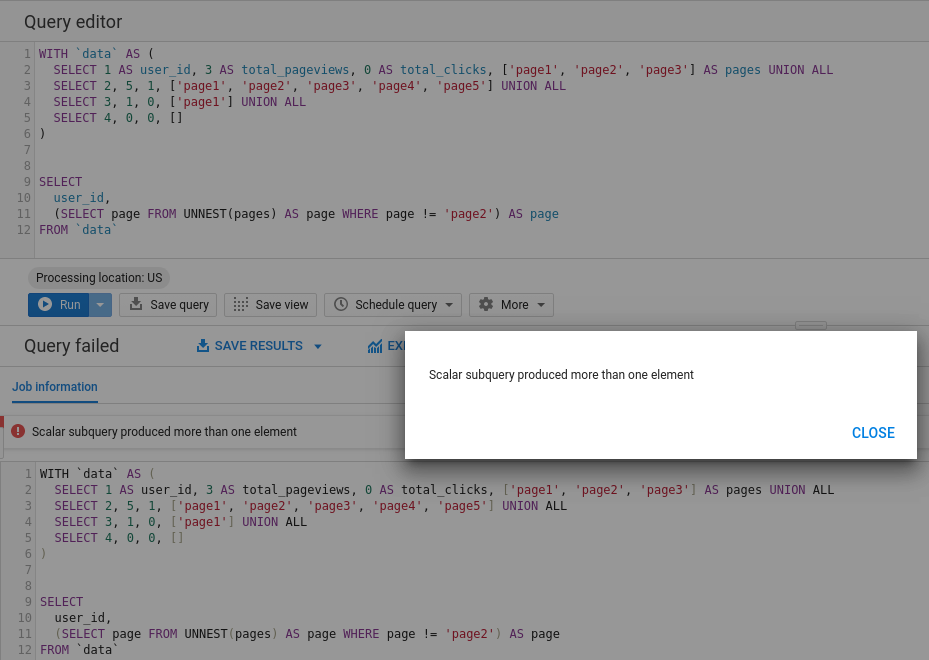
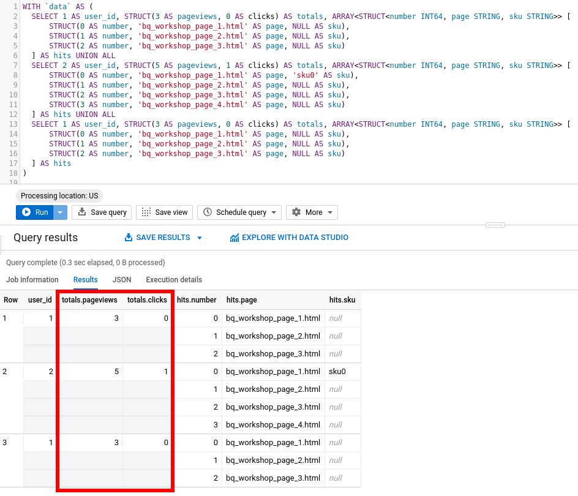
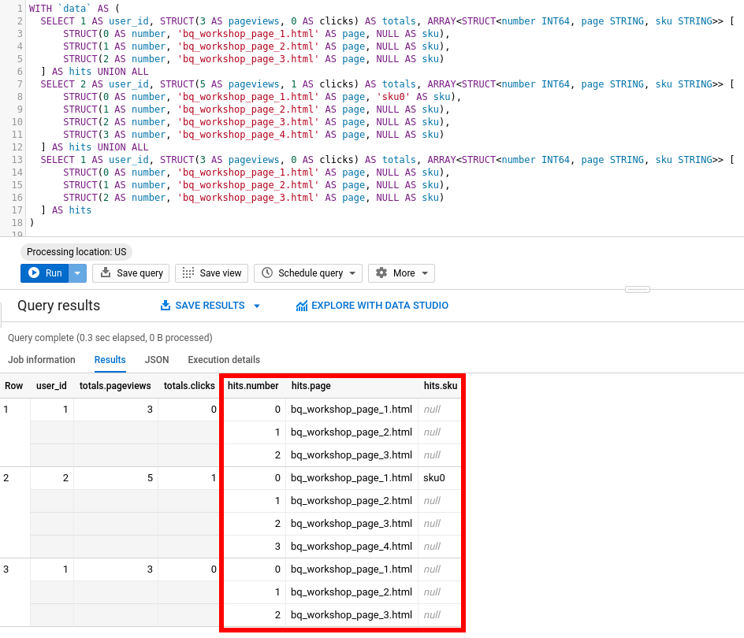

# Arrays And Structs

This tutorial covers the following:

1. [Introduction](#1-introduction)
2. [Arrays](#2-arrays)
    1. [Task 1](#2.1-task-1)
    2. [Task 2](#2.2-task-2)
    3. [OFFSET](#2.3-offset)
    4. [Task 3](#2.4-task-3)
    5. [UNNEST](#2.5-unnest)
    6. [Task 4](#2.6-task-4)
    7. [Subselect](#2.7-subselect)
    8. [ARRAY_AGG](#2.8-array_agg)
    9. [Task 5](#2.9-task-5)
3. [Structs](#3-structs)
    1. [Task 6](#3.1-task-6)
    2. [Task 7](#3.2-task-7)
4. [Cookbook](cookbook.md)
5. [Exercises](exercises.md)

## 1. Introduction

As we've seen in Class 01, one of the biggest powers of BigQuery comes from operating nested data directly, the better we use this paradigm, the less operations will be performed in the shuffle phase making it more effective, cheaper and faster.

But also, as we've discussed, it gets some practice to use it. So, with no further ado, let's exercise it.

Head over to your [BigQuery WebUI](https://console.cloud.google.com/bigquery) (if you haven't already please follow through [Class00 Setup](../Class00_Setup/README.md) for setting up the required environment) and run our very first demonstration query:

```sql
WITH `data` AS (
  SELECT 1 AS user_id, 3 AS total_pageviews, 0 AS total_clicks UNION ALL
  SELECT 2, 5, 1 UNION ALL
  SELECT 3, 1, 0
)


SELECT
  *
FROM `data`
```

You'll get something like this:

<p align="center">
  
</p>

In this example, we have a simulation of customers visiting a web page; first column is the user identification, second is how many pages were visited and, finally, how many clicks were tracked.

Notice the response can be represented as a JSON as well where each row represents each user:

```json
[
  {
    "user_id": "1",
    "total_pageviews": "3",
    "total_clicks": "0"
  },
  {
    "user_id": "2",
    "total_pageviews": "5",
    "total_clicks": "1"
  },
  {
    "user_id": "3",
    "total_pageviews": "1",
    "total_clicks": "0"
  }
]
```

And there you have it; no need to setup infrastructure or install applications, just open the console and run queries, BigQuery already takes care of everything for us.

All [types](https://cloud.google.com/bigquery/docs/reference/standard-sql/data-types) defined in other databases are also available in BigQuery; run the following to see some possibilities:

```sql
WITH `data` AS (
  SELECT 
    'string' AS STRING,
    1 AS INT64,
    1.25 AS FLOAT64,
    99999999999999999999999999999.999999999 AS NUMERIC,
    FALSE AND TRUE AS BOOLEAN,
    b'0x00' AS BYTES,
    DATE('2019-01-01') AS DATE,
    DATETIME('2019-01-01') AS DATETIME,
    '23:59:59' AS TIME,
    TIMESTAMP('2019-01-01 00:00:00') AS TIMESTAMP,
    ST_GEOGPOINT(40.3, 30.5) AS GEOPOINT
)


SELECT
  *
FROM `data`
```

Let's come back to our first query now: suppose we want to track which pages were visited and which products clicked; we'll track each "hit" on our web site, its number identification and actions.

To do so, run the following:

```sql
WITH `data` AS (
  SELECT 1 AS user_id, 3 AS total_pageviews, 0 AS total_clicks, 0 AS hit_number, 'bq_workshop_page_1.html' AS page, NULL AS sku UNION ALL
  SELECT 1 AS user_id, 3 AS total_pageviews, 0 AS total_clicks, 1 AS hit_number, 'bq_workshop_page_2.html' AS page, NULL AS sku UNION ALL
  SELECT 1 AS user_id, 3 AS total_pageviews, 0 AS total_clicks, 2 AS hit_number, 'bq_workshop_page_3.html' AS page, NULL AS sku UNION ALL
  
  SELECT 2 AS user_id, 5 AS total_pageviews, 1 AS total_clicks, 0 AS hit_number, 'bq_workshop_page_1.html' AS page, 'sku0' AS sku UNION ALL
  SELECT 2 AS user_id, 5 AS total_pageviews, 1 AS total_clicks, 1 AS hit_number, 'bq_workshop_page_2.html' AS page, NULL AS sku UNION ALL
  SELECT 2 AS user_id, 5 AS total_pageviews, 1 AS total_clicks, 2 AS hit_number, 'bq_workshop_page_3.html' AS page, NULL AS sku UNION ALL
  SELECT 2 AS user_id, 5 AS total_pageviews, 1 AS total_clicks, 3 AS hit_number, 'bq_workshop_page_4.html' AS page, NULL AS sku UNION ALL
  
  SELECT 3 AS user_id, 1 AS total_pageviews, 0 AS total_clicks, 0 AS hit_number, 'bq_workshop_page_1.html' AS page, NULL AS sku
)

SELECT
  *
FROM `data`
```

This is the result:

<table pan-table="" class="p6n-bq-results-table-pb p6n-table" role="grid" jslog="47391;track:generic_click"> <thead pan-sort-agent="sortCtrl"> <tr><!----> <th>Row</th> <!----><th ng-repeat="header in ctrl.schema.fields track by (ctrl.tableId + $index)"> user_id </th><!----><th ng-repeat="header in ctrl.schema.fields track by (ctrl.tableId + $index)"> total_pageviews </th><!----><th ng-repeat="header in ctrl.schema.fields track by (ctrl.tableId + $index)"> total_clicks </th><!----><th ng-repeat="header in ctrl.schema.fields track by (ctrl.tableId + $index)"> hit_number </th><!----><th ng-repeat="header in ctrl.schema.fields track by (ctrl.tableId + $index)"> page </th><!----><th ng-repeat="header in ctrl.schema.fields track by (ctrl.tableId + $index)"> sku </th><!----> <th class="p6n-bq-empty-last-column"></th> </tr> </thead> <tbody> <!----><tr pan-table-row="" ng-repeat="row in ctrl.rows | panSortBy:(sortCtrl&amp;&amp;sortCtrl.getActiveKey()):&quot;normal&quot;:sortCache:paginateCtrl  track by (ctrl.tableId + ':' + row.rowTrackBy + ':row' + $index)" class="p6n-bq-last-row-of-record" ng-bind-html="row.htmlRow" ng-init="$last &amp;&amp; panTableCtrl.onRowRepeatEnd()" pan-table-row-after-repeat="row"><td class="p6n-bq-row-number">1</td><td class="p6n-bq-number-cell"><div>1</div></td><td class="p6n-bq-number-cell"><div>3</div></td><td class="p6n-bq-number-cell"><div>0</div></td><td class="p6n-bq-number-cell"><div>0</div></td><td><div>bq_workshop_page_1.html</div></td><td><div class="p6n-bq-null-cell">null</div></td><td class="p6n-bq-empty-last-column"></td></tr><!----><tr pan-table-row="" ng-repeat="row in ctrl.rows | panSortBy:(sortCtrl&amp;&amp;sortCtrl.getActiveKey()):&quot;normal&quot;:sortCache:paginateCtrl  track by (ctrl.tableId + ':' + row.rowTrackBy + ':row' + $index)" class="p6n-bq-last-row-of-record" ng-bind-html="row.htmlRow" ng-init="$last &amp;&amp; panTableCtrl.onRowRepeatEnd()" pan-table-row-after-repeat="row"><td class="p6n-bq-row-number">2</td><td class="p6n-bq-number-cell"><div>1</div></td><td class="p6n-bq-number-cell"><div>3</div></td><td class="p6n-bq-number-cell"><div>0</div></td><td class="p6n-bq-number-cell"><div>1</div></td><td><div>bq_workshop_page_2.html</div></td><td><div class="p6n-bq-null-cell">null</div></td><td class="p6n-bq-empty-last-column"></td></tr><!----><tr pan-table-row="" ng-repeat="row in ctrl.rows | panSortBy:(sortCtrl&amp;&amp;sortCtrl.getActiveKey()):&quot;normal&quot;:sortCache:paginateCtrl  track by (ctrl.tableId + ':' + row.rowTrackBy + ':row' + $index)" class="p6n-bq-last-row-of-record" ng-bind-html="row.htmlRow" ng-init="$last &amp;&amp; panTableCtrl.onRowRepeatEnd()" pan-table-row-after-repeat="row"><td class="p6n-bq-row-number">3</td><td class="p6n-bq-number-cell"><div>1</div></td><td class="p6n-bq-number-cell"><div>3</div></td><td class="p6n-bq-number-cell"><div>0</div></td><td class="p6n-bq-number-cell"><div>2</div></td><td><div>bq_workshop_page_3.html</div></td><td><div class="p6n-bq-null-cell">null</div></td><td class="p6n-bq-empty-last-column"></td></tr><!----><tr pan-table-row="" ng-repeat="row in ctrl.rows | panSortBy:(sortCtrl&amp;&amp;sortCtrl.getActiveKey()):&quot;normal&quot;:sortCache:paginateCtrl  track by (ctrl.tableId + ':' + row.rowTrackBy + ':row' + $index)" class="p6n-bq-last-row-of-record" ng-bind-html="row.htmlRow" ng-init="$last &amp;&amp; panTableCtrl.onRowRepeatEnd()" pan-table-row-after-repeat="row"><td class="p6n-bq-row-number">4</td><td class="p6n-bq-number-cell"><div>2</div></td><td class="p6n-bq-number-cell"><div>5</div></td><td class="p6n-bq-number-cell"><div>1</div></td><td class="p6n-bq-number-cell"><div>0</div></td><td><div>bq_workshop_page_1.html</div></td><td><div>sku0</div></td><td class="p6n-bq-empty-last-column"></td></tr><!----><tr pan-table-row="" ng-repeat="row in ctrl.rows | panSortBy:(sortCtrl&amp;&amp;sortCtrl.getActiveKey()):&quot;normal&quot;:sortCache:paginateCtrl  track by (ctrl.tableId + ':' + row.rowTrackBy + ':row' + $index)" class="p6n-bq-last-row-of-record" ng-bind-html="row.htmlRow" ng-init="$last &amp;&amp; panTableCtrl.onRowRepeatEnd()" pan-table-row-after-repeat="row"><td class="p6n-bq-row-number">5</td><td class="p6n-bq-number-cell"><div>2</div></td><td class="p6n-bq-number-cell"><div>5</div></td><td class="p6n-bq-number-cell"><div>1</div></td><td class="p6n-bq-number-cell"><div>1</div></td><td><div>bq_workshop_page_2.html</div></td><td><div class="p6n-bq-null-cell">null</div></td><td class="p6n-bq-empty-last-column"></td></tr><!----><tr pan-table-row="" ng-repeat="row in ctrl.rows | panSortBy:(sortCtrl&amp;&amp;sortCtrl.getActiveKey()):&quot;normal&quot;:sortCache:paginateCtrl  track by (ctrl.tableId + ':' + row.rowTrackBy + ':row' + $index)" class="p6n-bq-last-row-of-record" ng-bind-html="row.htmlRow" ng-init="$last &amp;&amp; panTableCtrl.onRowRepeatEnd()" pan-table-row-after-repeat="row"><td class="p6n-bq-row-number">6</td><td class="p6n-bq-number-cell"><div>2</div></td><td class="p6n-bq-number-cell"><div>5</div></td><td class="p6n-bq-number-cell"><div>1</div></td><td class="p6n-bq-number-cell"><div>2</div></td><td><div>bq_workshop_page_3.html</div></td><td><div class="p6n-bq-null-cell">null</div></td><td class="p6n-bq-empty-last-column"></td></tr><!----><tr pan-table-row="" ng-repeat="row in ctrl.rows | panSortBy:(sortCtrl&amp;&amp;sortCtrl.getActiveKey()):&quot;normal&quot;:sortCache:paginateCtrl  track by (ctrl.tableId + ':' + row.rowTrackBy + ':row' + $index)" class="p6n-bq-last-row-of-record" ng-bind-html="row.htmlRow" ng-init="$last &amp;&amp; panTableCtrl.onRowRepeatEnd()" pan-table-row-after-repeat="row"><td class="p6n-bq-row-number">7</td><td class="p6n-bq-number-cell"><div>2</div></td><td class="p6n-bq-number-cell"><div>5</div></td><td class="p6n-bq-number-cell"><div>1</div></td><td class="p6n-bq-number-cell"><div>3</div></td><td><div>bq_workshop_page_4.html</div></td><td><div class="p6n-bq-null-cell">null</div></td><td class="p6n-bq-empty-last-column"></td></tr><!----><tr pan-table-row="" ng-repeat="row in ctrl.rows | panSortBy:(sortCtrl&amp;&amp;sortCtrl.getActiveKey()):&quot;normal&quot;:sortCache:paginateCtrl  track by (ctrl.tableId + ':' + row.rowTrackBy + ':row' + $index)" class="p6n-bq-last-row-of-record" ng-bind-html="row.htmlRow" ng-init="$last &amp;&amp; panTableCtrl.onRowRepeatEnd()" pan-table-row-after-repeat="row"><td class="p6n-bq-row-number">8</td><td class="p6n-bq-number-cell"><div>3</div></td><td class="p6n-bq-number-cell"><div>1</div></td><td class="p6n-bq-number-cell"><div>0</div></td><td class="p6n-bq-number-cell"><div>0</div></td><td><div>bq_workshop_page_1.html</div></td><td><div class="p6n-bq-null-cell">null</div></td><td class="p6n-bq-empty-last-column"></td></tr><!----> </tbody> </table>

Notice what happens here: as the data is flatten (i.e., not nested), we need to repeate the columns "user_id", "total_pageviews" and so on.

When working with small data this is fine but big data is another realm; reading terabytes of the same repeated field is not a very effective approach afterall.

What is recommended to do then is to apply denormalization to the point where we'll have several distinct tables into just one main table, each row already containing everything necessary for analysis. One technique for doing so is to use data representation of `ARRAY` that allows us to repeate data inside of a container stored in a field.

## 2. Arrays

That's where Arrays and Structs comes into play. [Arrays](https://cloud.google.com/bigquery/docs/reference/standard-sql/arrays) basically let us repeate a given field while refering to the exact same row; here's one way of building it:

```sql
WITH `data` AS (
  SELECT 1 AS user_id, 3 AS total_pageviews, 0 AS total_clicks, ['page1', 'page2', 'page3'] AS pages UNION ALL
  SELECT 2, 5, 1, ['page1', 'page2', 'page3', 'page4', 'page5'] UNION ALL
  SELECT 3, 1, 0, ['page1']
)


SELECT
  *
FROM `data`
```

Results:

<table pan-table="" class="p6n-bq-results-table-pb p6n-table" role="grid" jslog="47391;track:generic_click"> <thead pan-sort-agent="sortCtrl"> <tr><!----> <th>Row</th> <!----><th ng-repeat="header in ctrl.schema.fields track by (ctrl.tableId + $index)"> user_id </th><!----><th ng-repeat="header in ctrl.schema.fields track by (ctrl.tableId + $index)"> total_pageviews </th><!----><th ng-repeat="header in ctrl.schema.fields track by (ctrl.tableId + $index)"> total_clicks </th><!----><th ng-repeat="header in ctrl.schema.fields track by (ctrl.tableId + $index)"> pages </th><!----> <th class="p6n-bq-empty-last-column"></th> </tr> </thead> <tbody> <!----><tr pan-table-row="" ng-repeat="row in ctrl.rows | panSortBy:(sortCtrl&amp;&amp;sortCtrl.getActiveKey()):&quot;normal&quot;:sortCache:paginateCtrl  track by (ctrl.tableId + ':' + row.rowTrackBy + ':row' + $index)" class="" ng-bind-html="row.htmlRow" ng-init="$last &amp;&amp; panTableCtrl.onRowRepeatEnd()" pan-table-row-after-repeat="row"><td class="p6n-bq-row-number">1</td><td class="p6n-bq-number-cell"><div>1</div></td><td class="p6n-bq-number-cell"><div>3</div></td><td class="p6n-bq-number-cell"><div>0</div></td><td><div>page1</div></td><td class="p6n-bq-empty-last-column"></td></tr><!----><tr pan-table-row="" ng-repeat="row in ctrl.rows | panSortBy:(sortCtrl&amp;&amp;sortCtrl.getActiveKey()):&quot;normal&quot;:sortCache:paginateCtrl  track by (ctrl.tableId + ':' + row.rowTrackBy + ':row' + $index)" class="" ng-bind-html="row.htmlRow" ng-init="$last &amp;&amp; panTableCtrl.onRowRepeatEnd()" pan-table-row-after-repeat="row"><td class="p6n-bq-row-number"></td><td></td><td></td><td></td><td><div>page2</div></td><td class="p6n-bq-empty-last-column"></td></tr><!----><tr pan-table-row="" ng-repeat="row in ctrl.rows | panSortBy:(sortCtrl&amp;&amp;sortCtrl.getActiveKey()):&quot;normal&quot;:sortCache:paginateCtrl  track by (ctrl.tableId + ':' + row.rowTrackBy + ':row' + $index)" class="p6n-bq-last-row-of-record" ng-bind-html="row.htmlRow" ng-init="$last &amp;&amp; panTableCtrl.onRowRepeatEnd()" pan-table-row-after-repeat="row"><td class="p6n-bq-row-number"></td><td></td><td></td><td></td><td><div>page3</div></td><td class="p6n-bq-empty-last-column"></td></tr><!----><tr pan-table-row="" ng-repeat="row in ctrl.rows | panSortBy:(sortCtrl&amp;&amp;sortCtrl.getActiveKey()):&quot;normal&quot;:sortCache:paginateCtrl  track by (ctrl.tableId + ':' + row.rowTrackBy + ':row' + $index)" class="" ng-bind-html="row.htmlRow" ng-init="$last &amp;&amp; panTableCtrl.onRowRepeatEnd()" pan-table-row-after-repeat="row"><td class="p6n-bq-row-number">2</td><td class="p6n-bq-number-cell"><div>2</div></td><td class="p6n-bq-number-cell"><div>5</div></td><td class="p6n-bq-number-cell"><div>1</div></td><td><div>page1</div></td><td class="p6n-bq-empty-last-column"></td></tr><!----><tr pan-table-row="" ng-repeat="row in ctrl.rows | panSortBy:(sortCtrl&amp;&amp;sortCtrl.getActiveKey()):&quot;normal&quot;:sortCache:paginateCtrl  track by (ctrl.tableId + ':' + row.rowTrackBy + ':row' + $index)" class="" ng-bind-html="row.htmlRow" ng-init="$last &amp;&amp; panTableCtrl.onRowRepeatEnd()" pan-table-row-after-repeat="row"><td class="p6n-bq-row-number"></td><td></td><td></td><td></td><td><div>page2</div></td><td class="p6n-bq-empty-last-column"></td></tr><!----><tr pan-table-row="" ng-repeat="row in ctrl.rows | panSortBy:(sortCtrl&amp;&amp;sortCtrl.getActiveKey()):&quot;normal&quot;:sortCache:paginateCtrl  track by (ctrl.tableId + ':' + row.rowTrackBy + ':row' + $index)" class="" ng-bind-html="row.htmlRow" ng-init="$last &amp;&amp; panTableCtrl.onRowRepeatEnd()" pan-table-row-after-repeat="row"><td class="p6n-bq-row-number"></td><td></td><td></td><td></td><td><div>page3</div></td><td class="p6n-bq-empty-last-column"></td></tr><!----><tr pan-table-row="" ng-repeat="row in ctrl.rows | panSortBy:(sortCtrl&amp;&amp;sortCtrl.getActiveKey()):&quot;normal&quot;:sortCache:paginateCtrl  track by (ctrl.tableId + ':' + row.rowTrackBy + ':row' + $index)" class="" ng-bind-html="row.htmlRow" ng-init="$last &amp;&amp; panTableCtrl.onRowRepeatEnd()" pan-table-row-after-repeat="row"><td class="p6n-bq-row-number"></td><td></td><td></td><td></td><td><div>page4</div></td><td class="p6n-bq-empty-last-column"></td></tr><!----><tr pan-table-row="" ng-repeat="row in ctrl.rows | panSortBy:(sortCtrl&amp;&amp;sortCtrl.getActiveKey()):&quot;normal&quot;:sortCache:paginateCtrl  track by (ctrl.tableId + ':' + row.rowTrackBy + ':row' + $index)" class="p6n-bq-last-row-of-record" ng-bind-html="row.htmlRow" ng-init="$last &amp;&amp; panTableCtrl.onRowRepeatEnd()" pan-table-row-after-repeat="row"><td class="p6n-bq-row-number"></td><td></td><td></td><td></td><td><div>page5</div></td><td class="p6n-bq-empty-last-column"></td></tr><!----><tr pan-table-row="" ng-repeat="row in ctrl.rows | panSortBy:(sortCtrl&amp;&amp;sortCtrl.getActiveKey()):&quot;normal&quot;:sortCache:paginateCtrl  track by (ctrl.tableId + ':' + row.rowTrackBy + ':row' + $index)" class="p6n-bq-last-row-of-record" ng-bind-html="row.htmlRow" ng-init="$last &amp;&amp; panTableCtrl.onRowRepeatEnd()" pan-table-row-after-repeat="row"><td class="p6n-bq-row-number">3</td><td class="p6n-bq-number-cell"><div>3</div></td><td class="p6n-bq-number-cell"><div>1</div></td><td class="p6n-bq-number-cell"><div>0</div></td><td><div>page1</div></td><td class="p6n-bq-empty-last-column"></td></tr><!----> </tbody> </table>

Or in JSON format:

```json
[
  {
    "user_id": "1",
    "total_pageviews": "3",
    "total_clicks": "0",
    "pages": ["page1", "page2", "page3"]
  },
  {
    "user_id": "2",
    "total_pageviews": "5",
    "total_clicks": "1",
    "pages": ["page1", "page2", "page3", "page4", "page5"]
  },
  {
    "user_id": "3",
    "total_pageviews": "1",
    "total_clicks": "0",
    "pages": ["page1"]
  }
]
```

In just one row we already write all pages customers visited; no longer are we repeating `user_id` field for each page entry as before.

For those who know about [norm forms](https://en.wikipedia.org/wiki/Database_normalization), BigQuery goes to the opposite direction: the more denormalized data is, the better; storage costs are not as bad as processing costs; if a row already contains everything it needs then shuffle phase becomes much more efficient.

Instead of running `JOIN`s operations with huge amounts of data, we write everything required on each row and save the database the trouble of having to shuffle around up to teras or petabytes of data. 

To start getting some acquaintance with this concept, let's exercise a bit. We recommend you to create files in the [answers](./answers) folder with the name of the task (notice we already have some files there but they are encrypted ;)!)

### 2.1 Task 1

For our previous data of customers in a website:
  - add a new column named `time` specyfing the timestamp of when it ocurred (choose your own values, make sure to use timestamps)
  - add another named `page_type` (values can be either "home", "catalog" or "checkout").

Write your own query below:

```sql
# YOUR QUERY HERE
```

A possible result:

<table pan-table="" class="p6n-bq-results-table-pb p6n-table" role="grid" jslog="47391;track:generic_click"> <thead pan-sort-agent="sortCtrl"> <tr><!----> <th>Row</th> <!----><th ng-repeat="header in ctrl.schema.fields track by (ctrl.tableId + $index)"> user_id </th><!----><th ng-repeat="header in ctrl.schema.fields track by (ctrl.tableId + $index)"> total_pageviews </th><!----><th ng-repeat="header in ctrl.schema.fields track by (ctrl.tableId + $index)"> total_clicks </th><!----><th ng-repeat="header in ctrl.schema.fields track by (ctrl.tableId + $index)"> pages </th><!----><th ng-repeat="header in ctrl.schema.fields track by (ctrl.tableId + $index)"> time </th><!----><th ng-repeat="header in ctrl.schema.fields track by (ctrl.tableId + $index)"> page_type </th><!----> <th class="p6n-bq-empty-last-column"></th> </tr> </thead> <tbody> <!----><tr pan-table-row="" ng-repeat="row in ctrl.rows | panSortBy:(sortCtrl&amp;&amp;sortCtrl.getActiveKey()):&quot;normal&quot;:sortCache:paginateCtrl  track by (ctrl.tableId + ':' + row.rowTrackBy + ':row' + $index)" class="" ng-bind-html="row.htmlRow" ng-init="$last &amp;&amp; panTableCtrl.onRowRepeatEnd()" pan-table-row-after-repeat="row"><td class="p6n-bq-row-number">1</td><td class="p6n-bq-number-cell"><div>1</div></td><td class="p6n-bq-number-cell"><div>3</div></td><td class="p6n-bq-number-cell"><div>0</div></td><td><div>page1</div></td><td><div>2019-01-01 00:00:00 UTC</div></td><td><div>home</div></td><td class="p6n-bq-empty-last-column"></td></tr><!----><tr pan-table-row="" ng-repeat="row in ctrl.rows | panSortBy:(sortCtrl&amp;&amp;sortCtrl.getActiveKey()):&quot;normal&quot;:sortCache:paginateCtrl  track by (ctrl.tableId + ':' + row.rowTrackBy + ':row' + $index)" class="" ng-bind-html="row.htmlRow" ng-init="$last &amp;&amp; panTableCtrl.onRowRepeatEnd()" pan-table-row-after-repeat="row"><td class="p6n-bq-row-number"></td><td></td><td></td><td></td><td><div>page2</div></td><td><div>2019-01-01 00:01:00 UTC</div></td><td><div>catalog</div></td><td class="p6n-bq-empty-last-column"></td></tr><!----><tr pan-table-row="" ng-repeat="row in ctrl.rows | panSortBy:(sortCtrl&amp;&amp;sortCtrl.getActiveKey()):&quot;normal&quot;:sortCache:paginateCtrl  track by (ctrl.tableId + ':' + row.rowTrackBy + ':row' + $index)" class="p6n-bq-last-row-of-record" ng-bind-html="row.htmlRow" ng-init="$last &amp;&amp; panTableCtrl.onRowRepeatEnd()" pan-table-row-after-repeat="row"><td class="p6n-bq-row-number"></td><td></td><td></td><td></td><td><div>page3</div></td><td><div>2019-01-01 00:01:15 UTC</div></td><td><div>catalog</div></td><td class="p6n-bq-empty-last-column"></td></tr><!----><tr pan-table-row="" ng-repeat="row in ctrl.rows | panSortBy:(sortCtrl&amp;&amp;sortCtrl.getActiveKey()):&quot;normal&quot;:sortCache:paginateCtrl  track by (ctrl.tableId + ':' + row.rowTrackBy + ':row' + $index)" class="" ng-bind-html="row.htmlRow" ng-init="$last &amp;&amp; panTableCtrl.onRowRepeatEnd()" pan-table-row-after-repeat="row"><td class="p6n-bq-row-number">2</td><td class="p6n-bq-number-cell"><div>2</div></td><td class="p6n-bq-number-cell"><div>5</div></td><td class="p6n-bq-number-cell"><div>1</div></td><td><div>page1</div></td><td><div>2019-01-01 00:00:00 UTC</div></td><td><div>home</div></td><td class="p6n-bq-empty-last-column"></td></tr><!----><tr pan-table-row="" ng-repeat="row in ctrl.rows | panSortBy:(sortCtrl&amp;&amp;sortCtrl.getActiveKey()):&quot;normal&quot;:sortCache:paginateCtrl  track by (ctrl.tableId + ':' + row.rowTrackBy + ':row' + $index)" class="" ng-bind-html="row.htmlRow" ng-init="$last &amp;&amp; panTableCtrl.onRowRepeatEnd()" pan-table-row-after-repeat="row"><td class="p6n-bq-row-number"></td><td></td><td></td><td></td><td><div>page2</div></td><td><div>2019-01-01 00:01:00 UTC</div></td><td><div>catalog</div></td><td class="p6n-bq-empty-last-column"></td></tr><!----><tr pan-table-row="" ng-repeat="row in ctrl.rows | panSortBy:(sortCtrl&amp;&amp;sortCtrl.getActiveKey()):&quot;normal&quot;:sortCache:paginateCtrl  track by (ctrl.tableId + ':' + row.rowTrackBy + ':row' + $index)" class="" ng-bind-html="row.htmlRow" ng-init="$last &amp;&amp; panTableCtrl.onRowRepeatEnd()" pan-table-row-after-repeat="row"><td class="p6n-bq-row-number"></td><td></td><td></td><td></td><td><div>page3</div></td><td><div>2019-01-01 00:02:00 UTC</div></td><td><div>catalog</div></td><td class="p6n-bq-empty-last-column"></td></tr><!----><tr pan-table-row="" ng-repeat="row in ctrl.rows | panSortBy:(sortCtrl&amp;&amp;sortCtrl.getActiveKey()):&quot;normal&quot;:sortCache:paginateCtrl  track by (ctrl.tableId + ':' + row.rowTrackBy + ':row' + $index)" class="" ng-bind-html="row.htmlRow" ng-init="$last &amp;&amp; panTableCtrl.onRowRepeatEnd()" pan-table-row-after-repeat="row"><td class="p6n-bq-row-number"></td><td></td><td></td><td></td><td><div>page4</div></td><td><div>2019-01-01 00:03:00 UTC</div></td><td><div>catalog</div></td><td class="p6n-bq-empty-last-column"></td></tr><!----><tr pan-table-row="" ng-repeat="row in ctrl.rows | panSortBy:(sortCtrl&amp;&amp;sortCtrl.getActiveKey()):&quot;normal&quot;:sortCache:paginateCtrl  track by (ctrl.tableId + ':' + row.rowTrackBy + ':row' + $index)" class="p6n-bq-last-row-of-record" ng-bind-html="row.htmlRow" ng-init="$last &amp;&amp; panTableCtrl.onRowRepeatEnd()" pan-table-row-after-repeat="row"><td class="p6n-bq-row-number"></td><td></td><td></td><td></td><td><div>page5</div></td><td><div>2019-01-01 00:04:00 UTC</div></td><td><div>checkout</div></td><td class="p6n-bq-empty-last-column"></td></tr><!----><tr pan-table-row="" ng-repeat="row in ctrl.rows | panSortBy:(sortCtrl&amp;&amp;sortCtrl.getActiveKey()):&quot;normal&quot;:sortCache:paginateCtrl  track by (ctrl.tableId + ':' + row.rowTrackBy + ':row' + $index)" class="p6n-bq-last-row-of-record" ng-bind-html="row.htmlRow" ng-init="$last &amp;&amp; panTableCtrl.onRowRepeatEnd()" pan-table-row-after-repeat="row"><td class="p6n-bq-row-number">3</td><td class="p6n-bq-number-cell"><div>3</div></td><td class="p6n-bq-number-cell"><div>1</div></td><td class="p6n-bq-number-cell"><div>0</div></td><td><div>page1</div></td><td><div>2019-01-01 00:00:00 UTC</div></td><td><div>home</div></td><td class="p6n-bq-empty-last-column"></td></tr><!----> </tbody> </table>

Before moving on, sometimes you'll want to let BigQuery know explicitly what is the type of array field being created; this is done by specifying `ARRAY<type of field>` like so:

```sql
SELECT
  ARRAY<STRING> ['string1', 'string2']
```

### 2.2 Task 2

Use your query from the previous task, this time making explicit the types used on each array.

```sql
# YOUR QUERY HERE
```

This all sounds cool and stuff but you are probably wondering: "ok, how do we select values inside of arrays?!".

Well, that also requires new techniques; there are a few methods we can use here, each is more appropriate according to context. Let's see some approaches:

### 2.3 Offset

First approach we'll see is the [OFFSET](https://cloud.google.com/bigquery/docs/reference/standard-sql/array_functions#offset_and_ordinal): this function basically let's you select based on a integer index value.

Let's use our previous query as an example:

```sql
WITH `data` AS (
  SELECT 1 AS user_id, 3 AS total_pageviews, 0 AS total_clicks, ['page1', 'page2', 'page3'] AS pages UNION ALL
  SELECT 2, 5, 1, ['page1', 'page2', 'page3', 'page4', 'page5'] UNION ALL
  SELECT 3, 1, 0, ['page1']
)


SELECT
  user_id,
  pages[OFFSET(0)] AS page_0
FROM `data`
```

Which results:

<table pan-table="" class="p6n-bq-results-table-pb p6n-table" role="grid" jslog="47391;track:generic_click"> <thead pan-sort-agent="sortCtrl"> <tr><!----> <th>Row</th> <!----><th ng-repeat="header in ctrl.schema.fields track by (ctrl.tableId + $index)"> user_id </th><!----><th ng-repeat="header in ctrl.schema.fields track by (ctrl.tableId + $index)"> page_0 </th><!----> <th class="p6n-bq-empty-last-column"></th> </tr> </thead> <tbody> <!----><tr pan-table-row="" ng-repeat="row in ctrl.rows | panSortBy:(sortCtrl&amp;&amp;sortCtrl.getActiveKey()):&quot;normal&quot;:sortCache:paginateCtrl  track by (ctrl.tableId + ':' + row.rowTrackBy + ':row' + $index)" class="p6n-bq-last-row-of-record" ng-bind-html="row.htmlRow" ng-init="$last &amp;&amp; panTableCtrl.onRowRepeatEnd()" pan-table-row-after-repeat="row"><td class="p6n-bq-row-number">1</td><td class="p6n-bq-number-cell"><div>1</div></td><td><div>page1</div></td><td class="p6n-bq-empty-last-column"></td></tr><!----><tr pan-table-row="" ng-repeat="row in ctrl.rows | panSortBy:(sortCtrl&amp;&amp;sortCtrl.getActiveKey()):&quot;normal&quot;:sortCache:paginateCtrl  track by (ctrl.tableId + ':' + row.rowTrackBy + ':row' + $index)" class="p6n-bq-last-row-of-record" ng-bind-html="row.htmlRow" ng-init="$last &amp;&amp; panTableCtrl.onRowRepeatEnd()" pan-table-row-after-repeat="row"><td class="p6n-bq-row-number">2</td><td class="p6n-bq-number-cell"><div>2</div></td><td><div>page1</div></td><td class="p6n-bq-empty-last-column"></td></tr><!----><tr pan-table-row="" ng-repeat="row in ctrl.rows | panSortBy:(sortCtrl&amp;&amp;sortCtrl.getActiveKey()):&quot;normal&quot;:sortCache:paginateCtrl  track by (ctrl.tableId + ':' + row.rowTrackBy + ':row' + $index)" class="p6n-bq-last-row-of-record" ng-bind-html="row.htmlRow" ng-init="$last &amp;&amp; panTableCtrl.onRowRepeatEnd()" pan-table-row-after-repeat="row"><td class="p6n-bq-row-number">3</td><td class="p6n-bq-number-cell"><div>3</div></td><td><div>page1</div></td><td class="p6n-bq-empty-last-column"></td></tr><!----> </tbody> </table>

We effectively only retrieve the very first value on each array.

This approach can be all you need in your data processing task but it's not the only way to access values. Imagine, for instance, that you want to select all values in the array containing product descriptions pages; `OFFSET` technique will no longer work now.

We solve this with different approaches as we'll see soon.

But, before moving on, let's do another task. This time, it's required from you to retrieve all second values from the page arrays with one caveat: there are users with empty arrays:

```sql
WITH `data` AS (
  SELECT 1 AS user_id, 3 AS total_pageviews, 0 AS total_clicks, ['page1', 'page2', 'page3'] AS pages UNION ALL
  SELECT 2, 5, 1, ['page1', 'page2', 'page3', 'page4', 'page5'] UNION ALL
  SELECT 3, 1, 0, ['page1'] UNION ALL
  SELECT 4, 0, 0, []
)


SELECT
  user_id,
  pages[OFFSET(1)] AS page_1
FROM `data`
```

If you use plain simple `OFFSET` you'll observe this error message:

    Array index 1 is out of bounds (overflow)

So we have another challenge for you: run the previous query retrieving second values of each array avoiding the error exception.

To do so, you'll have to research and read BigQuery's own [documentation](https://cloud.google.com/bigquery/docs/reference/standard-sql/query-syntax). The purpose of this task is to start preparing you for what it's like to work with BigQuery: you'll advance by reading through the documentation (official docs are an increadible source of information) and other sources such as [Stackoverflow](https://stackoverflow.com/questions/tagged/google-bigquery) where Google have its own engineers (some working on BigQuery's code implementation itself) helping the community on their issues.

### 2.4 Task 3

Same as before but this time retrieve arrays on index 1 (second value).

```sql
WITH `data` AS (
  SELECT 1 AS user_id, 3 AS total_pageviews, 0 AS total_clicks, ['page1', 'page2', 'page3'] AS pages UNION ALL
  SELECT 2, 5, 1, ['page1', 'page2', 'page3', 'page4', 'page5'] UNION ALL
  SELECT 3, 1, 0, ['page1'] UNION ALL
  SELECT 4, 0, 0, []
)


# YOUR QUERY HERE
```

Expected result:

<table pan-table="" class="p6n-bq-results-table-pb p6n-table" role="grid" jslog="47391;track:generic_click"> <thead pan-sort-agent="sortCtrl"> <tr><!----> <th>Row</th> <!----><th ng-repeat="header in ctrl.schema.fields track by (ctrl.tableId + $index)"> user_id </th><!----><th ng-repeat="header in ctrl.schema.fields track by (ctrl.tableId + $index)"> page_1 </th><!----> <th class="p6n-bq-empty-last-column"></th> </tr> </thead> <tbody> <!----><tr pan-table-row="" ng-repeat="row in ctrl.rows | panSortBy:(sortCtrl&amp;&amp;sortCtrl.getActiveKey()):&quot;normal&quot;:sortCache:paginateCtrl  track by (ctrl.tableId + ':' + row.rowTrackBy + ':row' + $index)" class="p6n-bq-last-row-of-record" ng-bind-html="row.htmlRow" ng-init="$last &amp;&amp; panTableCtrl.onRowRepeatEnd()" pan-table-row-after-repeat="row"><td class="p6n-bq-row-number">1</td><td class="p6n-bq-number-cell"><div>1</div></td><td><div>page2</div></td><td class="p6n-bq-empty-last-column"></td></tr><!----><tr pan-table-row="" ng-repeat="row in ctrl.rows | panSortBy:(sortCtrl&amp;&amp;sortCtrl.getActiveKey()):&quot;normal&quot;:sortCache:paginateCtrl  track by (ctrl.tableId + ':' + row.rowTrackBy + ':row' + $index)" class="p6n-bq-last-row-of-record" ng-bind-html="row.htmlRow" ng-init="$last &amp;&amp; panTableCtrl.onRowRepeatEnd()" pan-table-row-after-repeat="row"><td class="p6n-bq-row-number">2</td><td class="p6n-bq-number-cell"><div>2</div></td><td><div>page2</div></td><td class="p6n-bq-empty-last-column"></td></tr><!----><tr pan-table-row="" ng-repeat="row in ctrl.rows | panSortBy:(sortCtrl&amp;&amp;sortCtrl.getActiveKey()):&quot;normal&quot;:sortCache:paginateCtrl  track by (ctrl.tableId + ':' + row.rowTrackBy + ':row' + $index)" class="p6n-bq-last-row-of-record" ng-bind-html="row.htmlRow" ng-init="$last &amp;&amp; panTableCtrl.onRowRepeatEnd()" pan-table-row-after-repeat="row"><td class="p6n-bq-row-number">3</td><td class="p6n-bq-number-cell"><div>3</div></td><td><div class="p6n-bq-null-cell">null</div></td><td class="p6n-bq-empty-last-column"></td></tr><!----><tr pan-table-row="" ng-repeat="row in ctrl.rows | panSortBy:(sortCtrl&amp;&amp;sortCtrl.getActiveKey()):&quot;normal&quot;:sortCache:paginateCtrl  track by (ctrl.tableId + ':' + row.rowTrackBy + ':row' + $index)" class="p6n-bq-last-row-of-record" ng-bind-html="row.htmlRow" ng-init="$last &amp;&amp; panTableCtrl.onRowRepeatEnd()" pan-table-row-after-repeat="row"><td class="p6n-bq-row-number">4</td><td class="p6n-bq-number-cell"><div>4</div></td><td><div class="p6n-bq-null-cell">null</div></td><td class="p6n-bq-empty-last-column"></td></tr><!----> </tbody> </table>

### 2.5 Unnest

`UNNEST` is the operation used to "open up" an array which means to no longer represent it as a "repeated" container of values but rather as a sequence of rows.

Here's an example to clarify the concept (notice that we use the `CROSS JOIN` operation to combine the array values with other fields that have been selected, in this case, `user_id`):

```sql
WITH `data` AS (
  SELECT 1 AS user_id, 3 AS total_pageviews, 0 AS total_clicks, ['page1', 'page2', 'page3'] AS pages UNION ALL
  SELECT 2, 5, 1, ['page1', 'page2', 'page3', 'page4', 'page5'] UNION ALL
  SELECT 3, 1, 0, ['page1'] UNION ALL
  SELECT 4, 0, 0, []
)

SELECT
  user_id,
  pages
FROM `data` 
CROSS JOIN UNNEST(pages) AS pages
```

Which results:

<table pan-table="" class="p6n-bq-results-table-pb p6n-table" role="grid" jslog="47391;track:generic_click"> <thead pan-sort-agent="sortCtrl"> <tr><!----> <th>Row</th> <!----><th ng-repeat="header in ctrl.schema.fields track by (ctrl.tableId + $index)"> user_id </th><!----><th ng-repeat="header in ctrl.schema.fields track by (ctrl.tableId + $index)"> pages </th><!----> <th class="p6n-bq-empty-last-column"></th> </tr> </thead> <tbody> <!----><tr pan-table-row="" ng-repeat="row in ctrl.rows | panSortBy:(sortCtrl&amp;&amp;sortCtrl.getActiveKey()):&quot;normal&quot;:sortCache:paginateCtrl  track by (ctrl.tableId + ':' + row.rowTrackBy + ':row' + $index)" class="p6n-bq-last-row-of-record" ng-bind-html="row.htmlRow" ng-init="$last &amp;&amp; panTableCtrl.onRowRepeatEnd()" pan-table-row-after-repeat="row"><td class="p6n-bq-row-number">1</td><td class="p6n-bq-number-cell"><div>1</div></td><td><div>page1</div></td><td class="p6n-bq-empty-last-column"></td></tr><!----><tr pan-table-row="" ng-repeat="row in ctrl.rows | panSortBy:(sortCtrl&amp;&amp;sortCtrl.getActiveKey()):&quot;normal&quot;:sortCache:paginateCtrl  track by (ctrl.tableId + ':' + row.rowTrackBy + ':row' + $index)" class="p6n-bq-last-row-of-record" ng-bind-html="row.htmlRow" ng-init="$last &amp;&amp; panTableCtrl.onRowRepeatEnd()" pan-table-row-after-repeat="row"><td class="p6n-bq-row-number">2</td><td class="p6n-bq-number-cell"><div>1</div></td><td><div>page2</div></td><td class="p6n-bq-empty-last-column"></td></tr><!----><tr pan-table-row="" ng-repeat="row in ctrl.rows | panSortBy:(sortCtrl&amp;&amp;sortCtrl.getActiveKey()):&quot;normal&quot;:sortCache:paginateCtrl  track by (ctrl.tableId + ':' + row.rowTrackBy + ':row' + $index)" class="p6n-bq-last-row-of-record" ng-bind-html="row.htmlRow" ng-init="$last &amp;&amp; panTableCtrl.onRowRepeatEnd()" pan-table-row-after-repeat="row"><td class="p6n-bq-row-number">3</td><td class="p6n-bq-number-cell"><div>1</div></td><td><div>page3</div></td><td class="p6n-bq-empty-last-column"></td></tr><!----><tr pan-table-row="" ng-repeat="row in ctrl.rows | panSortBy:(sortCtrl&amp;&amp;sortCtrl.getActiveKey()):&quot;normal&quot;:sortCache:paginateCtrl  track by (ctrl.tableId + ':' + row.rowTrackBy + ':row' + $index)" class="p6n-bq-last-row-of-record" ng-bind-html="row.htmlRow" ng-init="$last &amp;&amp; panTableCtrl.onRowRepeatEnd()" pan-table-row-after-repeat="row"><td class="p6n-bq-row-number">4</td><td class="p6n-bq-number-cell"><div>2</div></td><td><div>page1</div></td><td class="p6n-bq-empty-last-column"></td></tr><!----><tr pan-table-row="" ng-repeat="row in ctrl.rows | panSortBy:(sortCtrl&amp;&amp;sortCtrl.getActiveKey()):&quot;normal&quot;:sortCache:paginateCtrl  track by (ctrl.tableId + ':' + row.rowTrackBy + ':row' + $index)" class="p6n-bq-last-row-of-record" ng-bind-html="row.htmlRow" ng-init="$last &amp;&amp; panTableCtrl.onRowRepeatEnd()" pan-table-row-after-repeat="row"><td class="p6n-bq-row-number">5</td><td class="p6n-bq-number-cell"><div>2</div></td><td><div>page2</div></td><td class="p6n-bq-empty-last-column"></td></tr><!----><tr pan-table-row="" ng-repeat="row in ctrl.rows | panSortBy:(sortCtrl&amp;&amp;sortCtrl.getActiveKey()):&quot;normal&quot;:sortCache:paginateCtrl  track by (ctrl.tableId + ':' + row.rowTrackBy + ':row' + $index)" class="p6n-bq-last-row-of-record" ng-bind-html="row.htmlRow" ng-init="$last &amp;&amp; panTableCtrl.onRowRepeatEnd()" pan-table-row-after-repeat="row"><td class="p6n-bq-row-number">6</td><td class="p6n-bq-number-cell"><div>2</div></td><td><div>page3</div></td><td class="p6n-bq-empty-last-column"></td></tr><!----><tr pan-table-row="" ng-repeat="row in ctrl.rows | panSortBy:(sortCtrl&amp;&amp;sortCtrl.getActiveKey()):&quot;normal&quot;:sortCache:paginateCtrl  track by (ctrl.tableId + ':' + row.rowTrackBy + ':row' + $index)" class="p6n-bq-last-row-of-record" ng-bind-html="row.htmlRow" ng-init="$last &amp;&amp; panTableCtrl.onRowRepeatEnd()" pan-table-row-after-repeat="row"><td class="p6n-bq-row-number">7</td><td class="p6n-bq-number-cell"><div>2</div></td><td><div>page4</div></td><td class="p6n-bq-empty-last-column"></td></tr><!----><tr pan-table-row="" ng-repeat="row in ctrl.rows | panSortBy:(sortCtrl&amp;&amp;sortCtrl.getActiveKey()):&quot;normal&quot;:sortCache:paginateCtrl  track by (ctrl.tableId + ':' + row.rowTrackBy + ':row' + $index)" class="p6n-bq-last-row-of-record" ng-bind-html="row.htmlRow" ng-init="$last &amp;&amp; panTableCtrl.onRowRepeatEnd()" pan-table-row-after-repeat="row"><td class="p6n-bq-row-number">8</td><td class="p6n-bq-number-cell"><div>2</div></td><td><div>page5</div></td><td class="p6n-bq-empty-last-column"></td></tr><!----><tr pan-table-row="" ng-repeat="row in ctrl.rows | panSortBy:(sortCtrl&amp;&amp;sortCtrl.getActiveKey()):&quot;normal&quot;:sortCache:paginateCtrl  track by (ctrl.tableId + ':' + row.rowTrackBy + ':row' + $index)" class="p6n-bq-last-row-of-record" ng-bind-html="row.htmlRow" ng-init="$last &amp;&amp; panTableCtrl.onRowRepeatEnd()" pan-table-row-after-repeat="row"><td class="p6n-bq-row-number">9</td><td class="p6n-bq-number-cell"><div>3</div></td><td><div>page1</div></td><td class="p6n-bq-empty-last-column"></td></tr><!----> </tbody> </table>

All values inside array are no longer in the same row, the field `user_id` has been repeated now. To reference the newly created dataset, give it an alias; in this case, it's called "pages" which is used in the select operation along with user_id.

It can also be used with a simple comma so its equivalent (recommended) form would be:

```sql
SELECT
  user_id,
  pages
FROM `data`,
UNNEST(pages) AS pages
```

 **An important note to take: be very carefull with unnest operations!** Notice what happened to `user_id=4`: it was removed from results!

If the array is empty then the `UNNEST` will remove other fields related to it (such as `user_id`); to specifically avoid this issue, use `LEFT JOIN`:

```sql
WITH `data` AS (
  SELECT 1 AS user_id, 3 AS total_pageviews, 0 AS total_clicks, ['page1', 'page2', 'page3'] AS pages UNION ALL
  SELECT 2, 5, 1, ['page1', 'page2', 'page3', 'page4', 'page5'] UNION ALL
  SELECT 3, 1, 0, ['page1'] UNION ALL
  SELECT 4, 0, 0, []
)

SELECT
  user_id,
  pages
FROM `data` 
LEFT JOIN UNNEST(pages) AS pages
```

Which results:

<table pan-table="" class="p6n-bq-results-table-pb p6n-table" role="grid" jslog="47391;track:generic_click"> <thead pan-sort-agent="sortCtrl"> <tr><!----> <th>Row</th> <!----><th ng-repeat="header in ctrl.schema.fields track by (ctrl.tableId + $index)"> user_id </th><!----><th ng-repeat="header in ctrl.schema.fields track by (ctrl.tableId + $index)"> pages </th><!----> <th class="p6n-bq-empty-last-column"></th> </tr> </thead> <tbody> <!----><tr pan-table-row="" ng-repeat="row in ctrl.rows | panSortBy:(sortCtrl&amp;&amp;sortCtrl.getActiveKey()):&quot;normal&quot;:sortCache:paginateCtrl  track by (ctrl.tableId + ':' + row.rowTrackBy + ':row' + $index)" class="p6n-bq-last-row-of-record" ng-bind-html="row.htmlRow" ng-init="$last &amp;&amp; panTableCtrl.onRowRepeatEnd()" pan-table-row-after-repeat="row"><td class="p6n-bq-row-number">1</td><td class="p6n-bq-number-cell"><div>1</div></td><td><div>page1</div></td><td class="p6n-bq-empty-last-column"></td></tr><!----><tr pan-table-row="" ng-repeat="row in ctrl.rows | panSortBy:(sortCtrl&amp;&amp;sortCtrl.getActiveKey()):&quot;normal&quot;:sortCache:paginateCtrl  track by (ctrl.tableId + ':' + row.rowTrackBy + ':row' + $index)" class="p6n-bq-last-row-of-record" ng-bind-html="row.htmlRow" ng-init="$last &amp;&amp; panTableCtrl.onRowRepeatEnd()" pan-table-row-after-repeat="row"><td class="p6n-bq-row-number">2</td><td class="p6n-bq-number-cell"><div>1</div></td><td><div>page2</div></td><td class="p6n-bq-empty-last-column"></td></tr><!----><tr pan-table-row="" ng-repeat="row in ctrl.rows | panSortBy:(sortCtrl&amp;&amp;sortCtrl.getActiveKey()):&quot;normal&quot;:sortCache:paginateCtrl  track by (ctrl.tableId + ':' + row.rowTrackBy + ':row' + $index)" class="p6n-bq-last-row-of-record" ng-bind-html="row.htmlRow" ng-init="$last &amp;&amp; panTableCtrl.onRowRepeatEnd()" pan-table-row-after-repeat="row"><td class="p6n-bq-row-number">3</td><td class="p6n-bq-number-cell"><div>1</div></td><td><div>page3</div></td><td class="p6n-bq-empty-last-column"></td></tr><!----><tr pan-table-row="" ng-repeat="row in ctrl.rows | panSortBy:(sortCtrl&amp;&amp;sortCtrl.getActiveKey()):&quot;normal&quot;:sortCache:paginateCtrl  track by (ctrl.tableId + ':' + row.rowTrackBy + ':row' + $index)" class="p6n-bq-last-row-of-record" ng-bind-html="row.htmlRow" ng-init="$last &amp;&amp; panTableCtrl.onRowRepeatEnd()" pan-table-row-after-repeat="row"><td class="p6n-bq-row-number">4</td><td class="p6n-bq-number-cell"><div>2</div></td><td><div>page1</div></td><td class="p6n-bq-empty-last-column"></td></tr><!----><tr pan-table-row="" ng-repeat="row in ctrl.rows | panSortBy:(sortCtrl&amp;&amp;sortCtrl.getActiveKey()):&quot;normal&quot;:sortCache:paginateCtrl  track by (ctrl.tableId + ':' + row.rowTrackBy + ':row' + $index)" class="p6n-bq-last-row-of-record" ng-bind-html="row.htmlRow" ng-init="$last &amp;&amp; panTableCtrl.onRowRepeatEnd()" pan-table-row-after-repeat="row"><td class="p6n-bq-row-number">5</td><td class="p6n-bq-number-cell"><div>2</div></td><td><div>page2</div></td><td class="p6n-bq-empty-last-column"></td></tr><!----><tr pan-table-row="" ng-repeat="row in ctrl.rows | panSortBy:(sortCtrl&amp;&amp;sortCtrl.getActiveKey()):&quot;normal&quot;:sortCache:paginateCtrl  track by (ctrl.tableId + ':' + row.rowTrackBy + ':row' + $index)" class="p6n-bq-last-row-of-record" ng-bind-html="row.htmlRow" ng-init="$last &amp;&amp; panTableCtrl.onRowRepeatEnd()" pan-table-row-after-repeat="row"><td class="p6n-bq-row-number">6</td><td class="p6n-bq-number-cell"><div>2</div></td><td><div>page3</div></td><td class="p6n-bq-empty-last-column"></td></tr><!----><tr pan-table-row="" ng-repeat="row in ctrl.rows | panSortBy:(sortCtrl&amp;&amp;sortCtrl.getActiveKey()):&quot;normal&quot;:sortCache:paginateCtrl  track by (ctrl.tableId + ':' + row.rowTrackBy + ':row' + $index)" class="p6n-bq-last-row-of-record" ng-bind-html="row.htmlRow" ng-init="$last &amp;&amp; panTableCtrl.onRowRepeatEnd()" pan-table-row-after-repeat="row"><td class="p6n-bq-row-number">7</td><td class="p6n-bq-number-cell"><div>2</div></td><td><div>page4</div></td><td class="p6n-bq-empty-last-column"></td></tr><!----><tr pan-table-row="" ng-repeat="row in ctrl.rows | panSortBy:(sortCtrl&amp;&amp;sortCtrl.getActiveKey()):&quot;normal&quot;:sortCache:paginateCtrl  track by (ctrl.tableId + ':' + row.rowTrackBy + ':row' + $index)" class="p6n-bq-last-row-of-record" ng-bind-html="row.htmlRow" ng-init="$last &amp;&amp; panTableCtrl.onRowRepeatEnd()" pan-table-row-after-repeat="row"><td class="p6n-bq-row-number">8</td><td class="p6n-bq-number-cell"><div>2</div></td><td><div>page5</div></td><td class="p6n-bq-empty-last-column"></td></tr><!----><tr pan-table-row="" ng-repeat="row in ctrl.rows | panSortBy:(sortCtrl&amp;&amp;sortCtrl.getActiveKey()):&quot;normal&quot;:sortCache:paginateCtrl  track by (ctrl.tableId + ':' + row.rowTrackBy + ':row' + $index)" class="p6n-bq-last-row-of-record" ng-bind-html="row.htmlRow" ng-init="$last &amp;&amp; panTableCtrl.onRowRepeatEnd()" pan-table-row-after-repeat="row"><td class="p6n-bq-row-number">9</td><td class="p6n-bq-number-cell"><div>3</div></td><td><div>page1</div></td><td class="p6n-bq-empty-last-column"></td></tr><!----><tr pan-table-row="" ng-repeat="row in ctrl.rows | panSortBy:(sortCtrl&amp;&amp;sortCtrl.getActiveKey()):&quot;normal&quot;:sortCache:paginateCtrl  track by (ctrl.tableId + ':' + row.rowTrackBy + ':row' + $index)" class="p6n-bq-last-row-of-record" ng-bind-html="row.htmlRow" ng-init="$last &amp;&amp; panTableCtrl.onRowRepeatEnd()" pan-table-row-after-repeat="row"><td class="p6n-bq-row-number">10</td><td class="p6n-bq-number-cell"><div>4</div></td><td><div class="p6n-bq-null-cell">null</div></td><td class="p6n-bq-empty-last-column"></td></tr><!----> </tbody> </table>

Now `user_id=4` remains in results. It's important to keep this in mind because it's somewhat common to forget that and build reports with `CROSS_JOINS` all over the place and forget that potentially many rows are being discarded in the process leading to wrong reported results!

With whole dataset flatenned (unnested), we can select only pages equal to "page2"; this will be left as an exercise:

### 2.6 Task 4

Use the `UNNEST` operation to select user_id and pages equal to "page2".

    # YOUR QUERY HERE

### 2.7 Subselect

Both `OFFSET` and a global `UNNEST` have its own disavantages as well: we may want to select multiple values inside of an array, not know beforehand where a given value is located or even performance may degrade after unnesting an entire dataset (remember in the architecture class about the shuffling operations).

One way to work around this issue is by selecting values within arrays by using subselect queries and unnesting operations; it's easier to understand this concept with an example so let's jump right into it: 

```
WITH `data` AS (
  SELECT 1 AS user_id, 3 AS total_pageviews, 0 AS total_clicks, ['page1', 'page2', 'page3'] AS pages UNION ALL
  SELECT 2, 5, 1, ['page1', 'page2', 'page3', 'page4', 'page5'] UNION ALL
  SELECT 3, 1, 0, ['page1'] UNION ALL
  SELECT 4, 0, 0, []
)


SELECT
  user_id,
  (SELECT page FROM UNNEST(pages) AS page WHERE page = 'page2') AS page
FROM `data`
```

Which gives:

<table pan-table="" class="p6n-bq-results-table-pb p6n-table" role="grid" jslog="47391;track:generic_click"> <thead pan-sort-agent="sortCtrl"> <tr><!----> <th>Row</th> <!----><th ng-repeat="header in ctrl.schema.fields track by (ctrl.tableId + $index)"> user_id </th><!----><th ng-repeat="header in ctrl.schema.fields track by (ctrl.tableId + $index)"> page </th><!----> <th class="p6n-bq-empty-last-column"></th> </tr> </thead> <tbody> <!----><tr pan-table-row="" ng-repeat="row in ctrl.rows | panSortBy:(sortCtrl&amp;&amp;sortCtrl.getActiveKey()):&quot;normal&quot;:sortCache:paginateCtrl  track by (ctrl.tableId + ':' + row.rowTrackBy + ':row' + $index)" class="p6n-bq-last-row-of-record" ng-bind-html="row.htmlRow" ng-init="$last &amp;&amp; panTableCtrl.onRowRepeatEnd()" pan-table-row-after-repeat="row"><td class="p6n-bq-row-number">1</td><td class="p6n-bq-number-cell"><div>1</div></td><td><div>page2</div></td><td class="p6n-bq-empty-last-column"></td></tr><!----><tr pan-table-row="" ng-repeat="row in ctrl.rows | panSortBy:(sortCtrl&amp;&amp;sortCtrl.getActiveKey()):&quot;normal&quot;:sortCache:paginateCtrl  track by (ctrl.tableId + ':' + row.rowTrackBy + ':row' + $index)" class="p6n-bq-last-row-of-record" ng-bind-html="row.htmlRow" ng-init="$last &amp;&amp; panTableCtrl.onRowRepeatEnd()" pan-table-row-after-repeat="row"><td class="p6n-bq-row-number">2</td><td class="p6n-bq-number-cell"><div>2</div></td><td><div>page2</div></td><td class="p6n-bq-empty-last-column"></td></tr><!----><tr pan-table-row="" ng-repeat="row in ctrl.rows | panSortBy:(sortCtrl&amp;&amp;sortCtrl.getActiveKey()):&quot;normal&quot;:sortCache:paginateCtrl  track by (ctrl.tableId + ':' + row.rowTrackBy + ':row' + $index)" class="p6n-bq-last-row-of-record" ng-bind-html="row.htmlRow" ng-init="$last &amp;&amp; panTableCtrl.onRowRepeatEnd()" pan-table-row-after-repeat="row"><td class="p6n-bq-row-number">3</td><td class="p6n-bq-number-cell"><div>3</div></td><td><div class="p6n-bq-null-cell">null</div></td><td class="p6n-bq-empty-last-column"></td></tr><!----><tr pan-table-row="" ng-repeat="row in ctrl.rows | panSortBy:(sortCtrl&amp;&amp;sortCtrl.getActiveKey()):&quot;normal&quot;:sortCache:paginateCtrl  track by (ctrl.tableId + ':' + row.rowTrackBy + ':row' + $index)" class="p6n-bq-last-row-of-record" ng-bind-html="row.htmlRow" ng-init="$last &amp;&amp; panTableCtrl.onRowRepeatEnd()" pan-table-row-after-repeat="row"><td class="p6n-bq-row-number">4</td><td class="p6n-bq-number-cell"><div>4</div></td><td><div class="p6n-bq-null-cell">null</div></td><td class="p6n-bq-empty-last-column"></td></tr><!----> </tbody> </table>

Notice the inner query:

    (SELECT page FROM UNNEST(pages) AS page WHERE page = 'page2') AS page

First we have the operation `UNNEST(pages)`; remember we can't directly access values inside of an array with a `SELECT` operation so it's first unnested and given the "page" alias, then we select from "page" all desired values and run regular SQL operations.

There's one catch here though: so far we retrieved just one value from arrays; what happens if we retrieve more?

Run the following query to see what happens:

```sql
WITH `data` AS (
  SELECT 1 AS user_id, 3 AS total_pageviews, 0 AS total_clicks, ['page1', 'page2', 'page3'] AS pages UNION ALL
  SELECT 2, 5, 1, ['page1', 'page2', 'page3', 'page4', 'page5'] UNION ALL
  SELECT 3, 1, 0, ['page1'] UNION ALL
  SELECT 4, 0, 0, []
)


SELECT
  user_id,
  (SELECT page FROM UNNEST(pages) AS page WHERE page != 'page2') AS page
FROM `data`
```

You'll get this error:

<p align="center">
  
</p>

This happens because there is more than one page that is different of "page2" and only way of being represented in the same field is by being repeated inside an array.

For the next task, find the workaround to this problem.

```sql
  # YOUR QUERY HERE
```

Expected:

<table pan-table="" class="p6n-bq-results-table-pb p6n-table" role="grid" jslog="47391;track:generic_click"> <thead pan-sort-agent="sortCtrl"> <tr><!----> <th>Row</th> <!----><th ng-repeat="header in ctrl.schema.fields track by (ctrl.tableId + $index)"> user_id </th><!----><th ng-repeat="header in ctrl.schema.fields track by (ctrl.tableId + $index)"> page </th><!----> <th class="p6n-bq-empty-last-column"></th> </tr> </thead> <tbody> <!----><tr pan-table-row="" ng-repeat="row in ctrl.rows | panSortBy:(sortCtrl&amp;&amp;sortCtrl.getActiveKey()):&quot;normal&quot;:sortCache:paginateCtrl  track by (ctrl.tableId + ':' + row.rowTrackBy + ':row' + $index)" class="" ng-bind-html="row.htmlRow" ng-init="$last &amp;&amp; panTableCtrl.onRowRepeatEnd()" pan-table-row-after-repeat="row"><td class="p6n-bq-row-number">1</td><td class="p6n-bq-number-cell"><div>1</div></td><td><div>page1</div></td><td class="p6n-bq-empty-last-column"></td></tr><!----><tr pan-table-row="" ng-repeat="row in ctrl.rows | panSortBy:(sortCtrl&amp;&amp;sortCtrl.getActiveKey()):&quot;normal&quot;:sortCache:paginateCtrl  track by (ctrl.tableId + ':' + row.rowTrackBy + ':row' + $index)" class="p6n-bq-last-row-of-record" ng-bind-html="row.htmlRow" ng-init="$last &amp;&amp; panTableCtrl.onRowRepeatEnd()" pan-table-row-after-repeat="row"><td class="p6n-bq-row-number"></td><td></td><td><div>page3</div></td><td class="p6n-bq-empty-last-column"></td></tr><!----><tr pan-table-row="" ng-repeat="row in ctrl.rows | panSortBy:(sortCtrl&amp;&amp;sortCtrl.getActiveKey()):&quot;normal&quot;:sortCache:paginateCtrl  track by (ctrl.tableId + ':' + row.rowTrackBy + ':row' + $index)" class="" ng-bind-html="row.htmlRow" ng-init="$last &amp;&amp; panTableCtrl.onRowRepeatEnd()" pan-table-row-after-repeat="row"><td class="p6n-bq-row-number">2</td><td class="p6n-bq-number-cell"><div>2</div></td><td><div>page1</div></td><td class="p6n-bq-empty-last-column"></td></tr><!----><tr pan-table-row="" ng-repeat="row in ctrl.rows | panSortBy:(sortCtrl&amp;&amp;sortCtrl.getActiveKey()):&quot;normal&quot;:sortCache:paginateCtrl  track by (ctrl.tableId + ':' + row.rowTrackBy + ':row' + $index)" class="" ng-bind-html="row.htmlRow" ng-init="$last &amp;&amp; panTableCtrl.onRowRepeatEnd()" pan-table-row-after-repeat="row"><td class="p6n-bq-row-number"></td><td></td><td><div>page3</div></td><td class="p6n-bq-empty-last-column"></td></tr><!----><tr pan-table-row="" ng-repeat="row in ctrl.rows | panSortBy:(sortCtrl&amp;&amp;sortCtrl.getActiveKey()):&quot;normal&quot;:sortCache:paginateCtrl  track by (ctrl.tableId + ':' + row.rowTrackBy + ':row' + $index)" class="" ng-bind-html="row.htmlRow" ng-init="$last &amp;&amp; panTableCtrl.onRowRepeatEnd()" pan-table-row-after-repeat="row"><td class="p6n-bq-row-number"></td><td></td><td><div>page4</div></td><td class="p6n-bq-empty-last-column"></td></tr><!----><tr pan-table-row="" ng-repeat="row in ctrl.rows | panSortBy:(sortCtrl&amp;&amp;sortCtrl.getActiveKey()):&quot;normal&quot;:sortCache:paginateCtrl  track by (ctrl.tableId + ':' + row.rowTrackBy + ':row' + $index)" class="p6n-bq-last-row-of-record" ng-bind-html="row.htmlRow" ng-init="$last &amp;&amp; panTableCtrl.onRowRepeatEnd()" pan-table-row-after-repeat="row"><td class="p6n-bq-row-number"></td><td></td><td><div>page5</div></td><td class="p6n-bq-empty-last-column"></td></tr><!----><tr pan-table-row="" ng-repeat="row in ctrl.rows | panSortBy:(sortCtrl&amp;&amp;sortCtrl.getActiveKey()):&quot;normal&quot;:sortCache:paginateCtrl  track by (ctrl.tableId + ':' + row.rowTrackBy + ':row' + $index)" class="p6n-bq-last-row-of-record" ng-bind-html="row.htmlRow" ng-init="$last &amp;&amp; panTableCtrl.onRowRepeatEnd()" pan-table-row-after-repeat="row"><td class="p6n-bq-row-number">3</td><td class="p6n-bq-number-cell"><div>3</div></td><td><div>page1</div></td><td class="p6n-bq-empty-last-column"></td></tr><!----><tr pan-table-row="" ng-repeat="row in ctrl.rows | panSortBy:(sortCtrl&amp;&amp;sortCtrl.getActiveKey()):&quot;normal&quot;:sortCache:paginateCtrl  track by (ctrl.tableId + ':' + row.rowTrackBy + ':row' + $index)" class="p6n-bq-last-row-of-record" ng-bind-html="row.htmlRow" ng-init="$last &amp;&amp; panTableCtrl.onRowRepeatEnd()" pan-table-row-after-repeat="row"><td class="p6n-bq-row-number">4</td><td class="p6n-bq-number-cell"><div>4</div></td><td></td><td class="p6n-bq-empty-last-column"></td></tr><!----> </tbody> </table>

### 2.8 ARRAY_AGG

Another way of building arrays is by aggregating values using a joining key with the function [`ARRAY_AGG`](https://cloud.google.com/bigquery/docs/reference/standard-sql/functions-and-operators#array_agg). Let's say we have a list of customers and their favorite products, if the field customer is repeating itself and we want to avoid it, here's how:

```sql
WITH `data` AS (
  SELECT 1 AS user_id, 'sku0' AS sku UNION ALL
  SELECT 1, 'sku1' UNION ALL
  SELECT 1, 'sku2' UNION ALL
  SELECT 2, 'sku0' UNION ALL
  SELECT 2, 'sku1'
)


SELECT
  user_id,
  ARRAY_AGG(sku)
FROM `data`
GROUP BY user_id
```

<table pan-table="" class="p6n-bq-results-table-pb p6n-table" role="grid" jslog="47391;track:generic_click"> <thead pan-sort-agent="sortCtrl"> <tr><!----> <th>Row</th> <!----><th ng-repeat="header in ctrl.schema.fields track by (ctrl.tableId + $index)"> user_id </th><!----><th ng-repeat="header in ctrl.schema.fields track by (ctrl.tableId + $index)"> f0_ </th><!----> <th class="p6n-bq-empty-last-column"></th> </tr> </thead> <tbody> <!----><tr pan-table-row="" ng-repeat="row in ctrl.rows | panSortBy:(sortCtrl&amp;&amp;sortCtrl.getActiveKey()):&quot;normal&quot;:sortCache:paginateCtrl  track by (ctrl.tableId + ':' + row.rowTrackBy + ':row' + $index)" class="" ng-bind-html="row.htmlRow" ng-init="$last &amp;&amp; panTableCtrl.onRowRepeatEnd()" pan-table-row-after-repeat="row"><td class="p6n-bq-row-number">1</td><td class="p6n-bq-number-cell"><div>1</div></td><td><div>sku0</div></td><td class="p6n-bq-empty-last-column"></td></tr><!----><tr pan-table-row="" ng-repeat="row in ctrl.rows | panSortBy:(sortCtrl&amp;&amp;sortCtrl.getActiveKey()):&quot;normal&quot;:sortCache:paginateCtrl  track by (ctrl.tableId + ':' + row.rowTrackBy + ':row' + $index)" class="" ng-bind-html="row.htmlRow" ng-init="$last &amp;&amp; panTableCtrl.onRowRepeatEnd()" pan-table-row-after-repeat="row"><td class="p6n-bq-row-number"></td><td></td><td><div>sku1</div></td><td class="p6n-bq-empty-last-column"></td></tr><!----><tr pan-table-row="" ng-repeat="row in ctrl.rows | panSortBy:(sortCtrl&amp;&amp;sortCtrl.getActiveKey()):&quot;normal&quot;:sortCache:paginateCtrl  track by (ctrl.tableId + ':' + row.rowTrackBy + ':row' + $index)" class="p6n-bq-last-row-of-record" ng-bind-html="row.htmlRow" ng-init="$last &amp;&amp; panTableCtrl.onRowRepeatEnd()" pan-table-row-after-repeat="row"><td class="p6n-bq-row-number"></td><td></td><td><div>sku2</div></td><td class="p6n-bq-empty-last-column"></td></tr><!----><tr pan-table-row="" ng-repeat="row in ctrl.rows | panSortBy:(sortCtrl&amp;&amp;sortCtrl.getActiveKey()):&quot;normal&quot;:sortCache:paginateCtrl  track by (ctrl.tableId + ':' + row.rowTrackBy + ':row' + $index)" class="" ng-bind-html="row.htmlRow" ng-init="$last &amp;&amp; panTableCtrl.onRowRepeatEnd()" pan-table-row-after-repeat="row"><td class="p6n-bq-row-number">2</td><td class="p6n-bq-number-cell"><div>2</div></td><td><div>sku0</div></td><td class="p6n-bq-empty-last-column"></td></tr><!----><tr pan-table-row="" ng-repeat="row in ctrl.rows | panSortBy:(sortCtrl&amp;&amp;sortCtrl.getActiveKey()):&quot;normal&quot;:sortCache:paginateCtrl  track by (ctrl.tableId + ':' + row.rowTrackBy + ':row' + $index)" class="p6n-bq-last-row-of-record" ng-bind-html="row.htmlRow" ng-init="$last &amp;&amp; panTableCtrl.onRowRepeatEnd()" pan-table-row-after-repeat="row"><td class="p6n-bq-row-number"></td><td></td><td><div>sku1</div></td><td class="p6n-bq-empty-last-column"></td></tr><!----> </tbody> </table>

`ARRAY_AGG` can be a powerful technique when processing big data: queries that would exceed resources can in turn be successfully processed by first aggregating data in a repeated structure and then running the desired analysis. Keep this in mind as it can be quite of a powerful resource in your BigQuery tools belt.

Let's exercise the new concept.

### 2.9 Task 5

For the given data, aggregate the field `date` for each `user_id` with the conditions:
  - filter only rows that happened after midday (12pm).
  - Remove `NULLS`.
  - All users should be present in result.
  - Dates in final array should be ordered in descending form.
  
Use the official docs to explore different approaches you want to take.

```sql
WITH `data` AS (
  SELECT 1 AS user_id, '20190101 01:15:02' AS date UNION ALL
  SELECT 1, '20190101 12:33:10' UNION ALL
  SELECT 1, NULL UNION ALL
  SELECT 1, '20190101 13:15:02' UNION ALL
  SELECT 2, '20190101 00:00:00' UNION ALL
  SELECT 2, '20190101 13:00:00'
)

# YOUR QUERY HERE
```

Expected result:

<table pan-table="" class="p6n-bq-results-table-pb p6n-table" role="grid" jslog="47391;track:generic_click"> <thead pan-sort-agent="sortCtrl"> <tr><!----> <th>Row</th> <!----><th ng-repeat="header in ctrl.schema.fields track by (ctrl.tableId + $index)"> user_id </th><!----><th ng-repeat="header in ctrl.schema.fields track by (ctrl.tableId + $index)"> dates </th><!----> <th class="p6n-bq-empty-last-column"></th> </tr> </thead> <tbody> <!----><tr pan-table-row="" ng-repeat="row in ctrl.rows | panSortBy:(sortCtrl&amp;&amp;sortCtrl.getActiveKey()):&quot;normal&quot;:sortCache:paginateCtrl  track by (ctrl.tableId + ':' + row.rowTrackBy + ':row' + $index)" class="" ng-bind-html="row.htmlRow" ng-init="$last &amp;&amp; panTableCtrl.onRowRepeatEnd()" pan-table-row-after-repeat="row"><td class="p6n-bq-row-number">1</td><td class="p6n-bq-number-cell"><div>1</div></td><td><div>20190101 13:15:02</div></td><td class="p6n-bq-empty-last-column"></td></tr><!----><tr pan-table-row="" ng-repeat="row in ctrl.rows | panSortBy:(sortCtrl&amp;&amp;sortCtrl.getActiveKey()):&quot;normal&quot;:sortCache:paginateCtrl  track by (ctrl.tableId + ':' + row.rowTrackBy + ':row' + $index)" class="p6n-bq-last-row-of-record" ng-bind-html="row.htmlRow" ng-init="$last &amp;&amp; panTableCtrl.onRowRepeatEnd()" pan-table-row-after-repeat="row"><td class="p6n-bq-row-number"></td><td></td><td><div>20190101 12:33:10</div></td><td class="p6n-bq-empty-last-column"></td></tr><!----><tr pan-table-row="" ng-repeat="row in ctrl.rows | panSortBy:(sortCtrl&amp;&amp;sortCtrl.getActiveKey()):&quot;normal&quot;:sortCache:paginateCtrl  track by (ctrl.tableId + ':' + row.rowTrackBy + ':row' + $index)" class="p6n-bq-last-row-of-record" ng-bind-html="row.htmlRow" ng-init="$last &amp;&amp; panTableCtrl.onRowRepeatEnd()" pan-table-row-after-repeat="row"><td class="p6n-bq-row-number">2</td><td class="p6n-bq-number-cell"><div>2</div></td><td><div>20190101 13:00:00</div></td><td class="p6n-bq-empty-last-column"></td></tr><!----><td class="p6n-bq-empty-last-column"></td></tr><!----> </tbody> </table>

## 3. Structs

Finally the type [Struct](https://cloud.google.com/bigquery/docs/reference/standard-sql/data-types#struct-type).

Think of structs as if we are opening a new JSON, or, in other words, starting the path of a new branch in a tree for a given field.

Here's an example using structs with our previous example:

```sql
WITH `data` AS (
  SELECT 1 AS user_id, STRUCT(3 AS pageviews, 0 AS clicks) AS totals, ARRAY<STRUCT<number INT64, page STRING, sku STRING>> [STRUCT(0 AS number, 'bq_workshop_page_1.html' AS page, NULL AS sku), STRUCT(1 AS number, 'bq_workshop_page_2.html' AS page, NULL AS sku), STRUCT(2 AS number, 'bq_workshop_page_3.html' AS page, NULL AS sku)] AS hits
  
  UNION ALL
  
  SELECT 2 AS user_id, STRUCT(5 AS pageviews, 1 AS clicks) AS totals, ARRAY<STRUCT<number INT64, page STRING, sku STRING>> [STRUCT(0 AS number, 'bq_workshop_page_1.html' AS page, 'sku0' AS sku), STRUCT(1 AS number, 'bq_workshop_page_2.html' AS page, NULL AS sku), STRUCT(2 AS number, 'bq_workshop_page_3.html' AS page, NULL AS sku), STRUCT(3 AS number, 'bq_workshop_page_4.html' AS page, NULL AS sku)] AS hits 
  
  UNION ALL
  
  SELECT 1 AS user_id, STRUCT(3 AS pageviews, 0 AS clicks) AS totals, ARRAY<STRUCT<number INT64, page STRING, sku STRING>> [STRUCT(0 AS number, 'bq_workshop_page_1.html' AS page, NULL AS sku), STRUCT(1 AS number, 'bq_workshop_page_2.html' AS page, NULL AS sku), STRUCT(2 AS number, 'bq_workshop_page_3.html' AS page, NULL AS sku)] AS hits
)

SELECT
  *
FROM `data`


```

Which results:

<table pan-table="" class="p6n-bq-results-table-pb p6n-table" role="grid" jslog="47391;track:generic_click"> <thead pan-sort-agent="sortCtrl"> <tr><!----> <th>Row</th> <!----><th ng-repeat="header in ctrl.schema.fields track by (ctrl.tableId + $index)"> user_id </th><!----><th ng-repeat="header in ctrl.schema.fields track by (ctrl.tableId + $index)"> totals.pageviews </th><!----><th ng-repeat="header in ctrl.schema.fields track by (ctrl.tableId + $index)"> totals.clicks </th><!----><th ng-repeat="header in ctrl.schema.fields track by (ctrl.tableId + $index)"> hits.number </th><!----><th ng-repeat="header in ctrl.schema.fields track by (ctrl.tableId + $index)"> hits.page </th><!----><th ng-repeat="header in ctrl.schema.fields track by (ctrl.tableId + $index)"> hits.sku </th><!----> <th class="p6n-bq-empty-last-column"></th> </tr> </thead> <tbody> <!----><tr pan-table-row="" ng-repeat="row in ctrl.rows | panSortBy:(sortCtrl&amp;&amp;sortCtrl.getActiveKey()):&quot;normal&quot;:sortCache:paginateCtrl  track by (ctrl.tableId + ':' + row.rowTrackBy + ':row' + $index)" class="" ng-bind-html="row.htmlRow" ng-init="$last &amp;&amp; panTableCtrl.onRowRepeatEnd()" pan-table-row-after-repeat="row"><td class="p6n-bq-row-number">1</td><td class="p6n-bq-number-cell"><div>1</div></td><td class="p6n-bq-number-cell"><div>3</div></td><td class="p6n-bq-number-cell"><div>0</div></td><td class="p6n-bq-number-cell"><div>0</div></td><td><div>bq_workshop_page_1.html</div></td><td><div class="p6n-bq-null-cell">null</div></td><td class="p6n-bq-empty-last-column"></td></tr><!----><tr pan-table-row="" ng-repeat="row in ctrl.rows | panSortBy:(sortCtrl&amp;&amp;sortCtrl.getActiveKey()):&quot;normal&quot;:sortCache:paginateCtrl  track by (ctrl.tableId + ':' + row.rowTrackBy + ':row' + $index)" class="" ng-bind-html="row.htmlRow" ng-init="$last &amp;&amp; panTableCtrl.onRowRepeatEnd()" pan-table-row-after-repeat="row"><td class="p6n-bq-row-number"></td><td></td><td></td><td></td><td class="p6n-bq-number-cell"><div>1</div></td><td><div>bq_workshop_page_2.html</div></td><td><div class="p6n-bq-null-cell">null</div></td><td class="p6n-bq-empty-last-column"></td></tr><!----><tr pan-table-row="" ng-repeat="row in ctrl.rows | panSortBy:(sortCtrl&amp;&amp;sortCtrl.getActiveKey()):&quot;normal&quot;:sortCache:paginateCtrl  track by (ctrl.tableId + ':' + row.rowTrackBy + ':row' + $index)" class="p6n-bq-last-row-of-record" ng-bind-html="row.htmlRow" ng-init="$last &amp;&amp; panTableCtrl.onRowRepeatEnd()" pan-table-row-after-repeat="row"><td class="p6n-bq-row-number"></td><td></td><td></td><td></td><td class="p6n-bq-number-cell"><div>2</div></td><td><div>bq_workshop_page_3.html</div></td><td><div class="p6n-bq-null-cell">null</div></td><td class="p6n-bq-empty-last-column"></td></tr><!----><tr pan-table-row="" ng-repeat="row in ctrl.rows | panSortBy:(sortCtrl&amp;&amp;sortCtrl.getActiveKey()):&quot;normal&quot;:sortCache:paginateCtrl  track by (ctrl.tableId + ':' + row.rowTrackBy + ':row' + $index)" class="" ng-bind-html="row.htmlRow" ng-init="$last &amp;&amp; panTableCtrl.onRowRepeatEnd()" pan-table-row-after-repeat="row"><td class="p6n-bq-row-number">2</td><td class="p6n-bq-number-cell"><div>2</div></td><td class="p6n-bq-number-cell"><div>5</div></td><td class="p6n-bq-number-cell"><div>1</div></td><td class="p6n-bq-number-cell"><div>0</div></td><td><div>bq_workshop_page_1.html</div></td><td><div>sku0</div></td><td class="p6n-bq-empty-last-column"></td></tr><!----><tr pan-table-row="" ng-repeat="row in ctrl.rows | panSortBy:(sortCtrl&amp;&amp;sortCtrl.getActiveKey()):&quot;normal&quot;:sortCache:paginateCtrl  track by (ctrl.tableId + ':' + row.rowTrackBy + ':row' + $index)" class="" ng-bind-html="row.htmlRow" ng-init="$last &amp;&amp; panTableCtrl.onRowRepeatEnd()" pan-table-row-after-repeat="row"><td class="p6n-bq-row-number"></td><td></td><td></td><td></td><td class="p6n-bq-number-cell"><div>1</div></td><td><div>bq_workshop_page_2.html</div></td><td><div class="p6n-bq-null-cell">null</div></td><td class="p6n-bq-empty-last-column"></td></tr><!----><tr pan-table-row="" ng-repeat="row in ctrl.rows | panSortBy:(sortCtrl&amp;&amp;sortCtrl.getActiveKey()):&quot;normal&quot;:sortCache:paginateCtrl  track by (ctrl.tableId + ':' + row.rowTrackBy + ':row' + $index)" class="" ng-bind-html="row.htmlRow" ng-init="$last &amp;&amp; panTableCtrl.onRowRepeatEnd()" pan-table-row-after-repeat="row"><td class="p6n-bq-row-number"></td><td></td><td></td><td></td><td class="p6n-bq-number-cell"><div>2</div></td><td><div>bq_workshop_page_3.html</div></td><td><div class="p6n-bq-null-cell">null</div></td><td class="p6n-bq-empty-last-column"></td></tr><!----><tr pan-table-row="" ng-repeat="row in ctrl.rows | panSortBy:(sortCtrl&amp;&amp;sortCtrl.getActiveKey()):&quot;normal&quot;:sortCache:paginateCtrl  track by (ctrl.tableId + ':' + row.rowTrackBy + ':row' + $index)" class="p6n-bq-last-row-of-record" ng-bind-html="row.htmlRow" ng-init="$last &amp;&amp; panTableCtrl.onRowRepeatEnd()" pan-table-row-after-repeat="row"><td class="p6n-bq-row-number"></td><td></td><td></td><td></td><td class="p6n-bq-number-cell"><div>3</div></td><td><div>bq_workshop_page_4.html</div></td><td><div class="p6n-bq-null-cell">null</div></td><td class="p6n-bq-empty-last-column"></td></tr><!----><tr pan-table-row="" ng-repeat="row in ctrl.rows | panSortBy:(sortCtrl&amp;&amp;sortCtrl.getActiveKey()):&quot;normal&quot;:sortCache:paginateCtrl  track by (ctrl.tableId + ':' + row.rowTrackBy + ':row' + $index)" class="" ng-bind-html="row.htmlRow" ng-init="$last &amp;&amp; panTableCtrl.onRowRepeatEnd()" pan-table-row-after-repeat="row"><td class="p6n-bq-row-number">3</td><td class="p6n-bq-number-cell"><div>1</div></td><td class="p6n-bq-number-cell"><div>3</div></td><td class="p6n-bq-number-cell"><div>0</div></td><td class="p6n-bq-number-cell"><div>0</div></td><td><div>bq_workshop_page_1.html</div></td><td><div class="p6n-bq-null-cell">null</div></td><td class="p6n-bq-empty-last-column"></td></tr><!----><tr pan-table-row="" ng-repeat="row in ctrl.rows | panSortBy:(sortCtrl&amp;&amp;sortCtrl.getActiveKey()):&quot;normal&quot;:sortCache:paginateCtrl  track by (ctrl.tableId + ':' + row.rowTrackBy + ':row' + $index)" class="" ng-bind-html="row.htmlRow" ng-init="$last &amp;&amp; panTableCtrl.onRowRepeatEnd()" pan-table-row-after-repeat="row"><td class="p6n-bq-row-number"></td><td></td><td></td><td></td><td class="p6n-bq-number-cell"><div>1</div></td><td><div>bq_workshop_page_2.html</div></td><td><div class="p6n-bq-null-cell">null</div></td><td class="p6n-bq-empty-last-column"></td></tr><!----><tr pan-table-row="" ng-repeat="row in ctrl.rows | panSortBy:(sortCtrl&amp;&amp;sortCtrl.getActiveKey()):&quot;normal&quot;:sortCache:paginateCtrl  track by (ctrl.tableId + ':' + row.rowTrackBy + ':row' + $index)" class="p6n-bq-last-row-of-record" ng-bind-html="row.htmlRow" ng-init="$last &amp;&amp; panTableCtrl.onRowRepeatEnd()" pan-table-row-after-repeat="row"><td class="p6n-bq-row-number"></td><td></td><td></td><td></td><td class="p6n-bq-number-cell"><div>2</div></td><td><div>bq_workshop_page_3.html</div></td><td><div class="p6n-bq-null-cell">null</div></td><td class="p6n-bq-empty-last-column"></td></tr><!----> </tbody> </table>

In JSON format:
```json
[
  {
    "user_id": "1",
    "totals": {
      "pageviews": "3",
      "clicks": "0"
    },
    "hits": [
      {
        "number": "0",
        "page": "bq_workshop_page_1.html",
        "sku": null
      },
      {
        "number": "1",
        "page": "bq_workshop_page_2.html",
        "sku": null
      },
      {
        "number": "2",
        "page": "bq_workshop_page_3.html",
        "sku": null
      }
    ]
  },
  {
    "user_id": "2",
    "totals": {
      "pageviews": "5",
      "clicks": "1"
    },
    "hits": [
      {
        "number": "0",
        "page": "bq_workshop_page_1.html",
        "sku": "sku0"
      },
      {
        "number": "1",
        "page": "bq_workshop_page_2.html",
        "sku": null
      },
      {
        "number": "2",
        "page": "bq_workshop_page_3.html",
        "sku": null
      },
      {
        "number": "3",
        "page": "bq_workshop_page_4.html",
        "sku": null
      }
    ]
  },
  {
    "user_id": "1",
    "totals": {
      "pageviews": "3",
      "clicks": "0"
    },
    "hits": [
      {
        "number": "0",
        "page": "bq_workshop_page_1.html",
        "sku": null
      },
      {
        "number": "1",
        "page": "bq_workshop_page_2.html",
        "sku": null
      },
      {
        "number": "2",
        "page": "bq_workshop_page_3.html",
        "sku": null
      }
    ]
  }
]
```

We have what could be considered two new tables, the first is represented by "totals" and the second by "hits".

<p align="center">
  
</p>

And hits:

<p align="center">
  
</p>

When we query about a user, we already have in a row all information about aggregated data (totals field) and each action performed (hits) so we don't need to run `JOIN` operations between different tables. This, essentially, makes it possible to process terabytes of data in seconds.

Notice that a table is defined as a repeated struct, i.e., it's already something like [{}, {}, ..., {}].

Now, practice time:

### 3.1 Task 6

You are given the following data:

```
user_id, time, id, page, page_type, product
1, 12:30:00, 1, p0, home, NULL
1, 12:31:00, 2, p1, catalog, sku0
1, 12:31:00, 2, p1, catalog, sku1
1, 12:32:00, 3, p2, product, sku0
```

Use the ARRAY and STRUCT syntax to achieve the following structure:

    [{"user_id": 1, "hits": [{"time": "12:30:00", "id": 1, "page": "p0", "page_type": "home", "products": NULL}, {"time": "12:31:00", "id": 2, "page": "p1", "page_type": "catalog", "products": ["sku0", "sku1"]}, {"time": "12:32:00", "id": 3, "page": "p2", "page_type": "product", "products": ["sku0"]}]}]

```
WITH `data` AS(
  # YOUR QUERY HERE
)

SELECT * FROM `data`
```

### 3.2 Task 7

Another challenge for you now: remember the `ARRAY_AGG` and sub-selecting from arrays?

Build the same nested schema as before, this time using aggregations of arrays and subselects, as you see fit.

```
WITH `data` AS (
  SELECT 1 AS user_id, '12:30:00' AS time, 1 AS id, 'p0' AS page, 'home' AS page_type, NULL AS product UNION ALL
  SELECT 1, '12:31:00', 2, 'p1', 'catalog', 'sku0' UNION ALL
  SELECT 1, '12:31:00', 2, 'p1', 'catalog', 'sku1' UNION ALL
  SELECT 1, '12:32:00', 3, 'p2', 'product', 'sku0'
)

# YOUR QUERY HERE
```

You should find this:

<table pan-table="" class="p6n-bq-results-table-pb p6n-table" role="grid" jslog="47391;track:generic_click"> <thead pan-sort-agent="sortCtrl"> <tr><!----> <th>Row</th> <!----><th ng-repeat="header in ctrl.schema.fields track by (ctrl.tableId + $index)"> user_id </th><!----><th ng-repeat="header in ctrl.schema.fields track by (ctrl.tableId + $index)"> hits.time </th><!----><th ng-repeat="header in ctrl.schema.fields track by (ctrl.tableId + $index)"> hits.id </th><!----><th ng-repeat="header in ctrl.schema.fields track by (ctrl.tableId + $index)"> hits.page </th><!----><th ng-repeat="header in ctrl.schema.fields track by (ctrl.tableId + $index)"> hits.page_type </th><!----><th ng-repeat="header in ctrl.schema.fields track by (ctrl.tableId + $index)"> hits.products </th><!----> <th class="p6n-bq-empty-last-column"></th> </tr> </thead> <tbody> <!----><tr pan-table-row="" ng-repeat="row in ctrl.rows | panSortBy:(sortCtrl&amp;&amp;sortCtrl.getActiveKey()):&quot;normal&quot;:sortCache:paginateCtrl  track by (ctrl.tableId + ':' + row.rowTrackBy + ':row' + $index)" class="" ng-bind-html="row.htmlRow" ng-init="$last &amp;&amp; panTableCtrl.onRowRepeatEnd()" pan-table-row-after-repeat="row"><td class="p6n-bq-row-number">1</td><td class="p6n-bq-number-cell"><div>1</div></td><td><div>12:30:00</div></td><td class="p6n-bq-number-cell"><div>1</div></td><td><div>p0</div></td><td><div>home</div></td><td></td><td class="p6n-bq-empty-last-column"></td></tr><!----><tr pan-table-row="" ng-repeat="row in ctrl.rows | panSortBy:(sortCtrl&amp;&amp;sortCtrl.getActiveKey()):&quot;normal&quot;:sortCache:paginateCtrl  track by (ctrl.tableId + ':' + row.rowTrackBy + ':row' + $index)" class="" ng-bind-html="row.htmlRow" ng-init="$last &amp;&amp; panTableCtrl.onRowRepeatEnd()" pan-table-row-after-repeat="row"><td class="p6n-bq-row-number"></td><td></td><td><div>12:31:00</div></td><td class="p6n-bq-number-cell"><div>2</div></td><td><div>p1</div></td><td><div>catalog</div></td><td><div>sku0</div></td><td class="p6n-bq-empty-last-column"></td></tr><!----><tr pan-table-row="" ng-repeat="row in ctrl.rows | panSortBy:(sortCtrl&amp;&amp;sortCtrl.getActiveKey()):&quot;normal&quot;:sortCache:paginateCtrl  track by (ctrl.tableId + ':' + row.rowTrackBy + ':row' + $index)" class="" ng-bind-html="row.htmlRow" ng-init="$last &amp;&amp; panTableCtrl.onRowRepeatEnd()" pan-table-row-after-repeat="row"><td class="p6n-bq-row-number"></td><td></td><td></td><td></td><td></td><td></td><td><div>sku1</div></td><td class="p6n-bq-empty-last-column"></td></tr><!----><tr pan-table-row="" ng-repeat="row in ctrl.rows | panSortBy:(sortCtrl&amp;&amp;sortCtrl.getActiveKey()):&quot;normal&quot;:sortCache:paginateCtrl  track by (ctrl.tableId + ':' + row.rowTrackBy + ':row' + $index)" class="p6n-bq-last-row-of-record" ng-bind-html="row.htmlRow" ng-init="$last &amp;&amp; panTableCtrl.onRowRepeatEnd()" pan-table-row-after-repeat="row"><td class="p6n-bq-row-number"></td><td></td><td><div>12:32:00</div></td><td class="p6n-bq-number-cell"><div>3</div></td><td><div>p2</div></td><td><div>product</div></td><td><div>sku0</div></td><td class="p6n-bq-empty-last-column"></td></tr><!----> </tbody> </table>

This, more or less, finishes our introduction fo Structs and Arrays.

We are not done yet though ;)! Let's put these concepts into practice in the next chapters to further understand their implementation. We recommend you going to [cookbook](cookbook.md) where you'll find some queries we prepared for you as an example and guideline that you can use when working with BigQuery.

We recommend studying each query and learning how the techniques are being used to process data.

After that, you'll probably be ready to face a list of proposed [exercises](exercises.md) where you'll be able to test your acquired knowledge.


