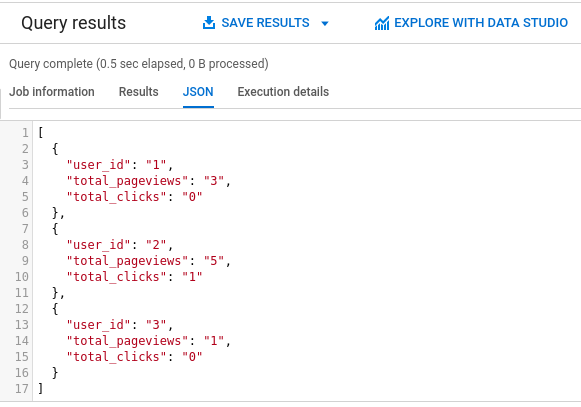

# Arrays And Structs

## Introduction

As we've seen in Class 01, one of the biggest powers of BigQuery comes from operation nested data directly. The better we use this paradigm the less slots will be allocated to our queries which in turn makes BigQuery more effective, cheaper and faster.

But also, as we've discussed there, it gets some practice before getting used to that. So with no further ado, let's get some practice.

## Practice Time

Head over to your BigQuery WebUI (if you haven't already please follow through [Class00 Setup](../Class00_Setup/README.md) for setting up the required environment) and run the following query:

```sql
WITH `data` AS (
  SELECT 1 AS user_id, 3 AS total_pageviews, 0 AS total_clicks UNION ALL
  SELECT 2, 5, 1 UNION ALL
  SELECT 3, 1, 0
)


SELECT
  *
FROM `data`
```

You'll get something like this:

<p align="center">
  
</p>

Notice the response can be represented as a JSON:

<p align="center">
  
</p>


